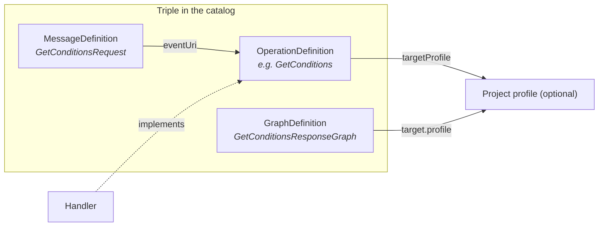

# Contributing

> Version 0.9.0 <!-- x-release-please-version -->

This document describes how the Query Broker is developed, tested, and extended with project-specific operations.

---

## 1. Set up the development environment

```bash
git clone https://github.com/forschungsgruppe-digital-health/pds-query-broker.git
cd pds-query-broker
cd docker && cp .env.example .env && docker compose up -d   # RabbitMQ (5672), catalog (8090), broker (8080), example connector (8082)
cd .. && ./gradlew build   # unit + Testcontainers integration tests (needs a Docker daemon)
```

---

## 2. Implement a PDS connector

### Step 1: Generate a stub

Transport stubs are generated with the official [AsyncAPI Generator](https://www.asyncapi.com/tools/generator) via `@asyncapi/cli`, using the in-repo template (the official language templates do not support AsyncAPI v3 yet — see [java-spring-template#308](https://github.com/asyncapi/java-spring-template/issues/308), [python-paho-template#189](https://github.com/asyncapi/python-paho-template/issues/189)):

```bash
(cd tools/asyncapi-templates/qb-transport-stub && npm ci)   # once
npx --yes @asyncapi/cli@4.1.1 generate fromTemplate specs/pds-connector-base.yaml \
  ./tools/asyncapi-templates/qb-transport-stub -o tools/asyncapi-stub/generated --force-write
```

This emits `qb_stub.py` (Python) and `BrokerTransportSpec.java` (Java) with the spec's transport facts; `tools/asyncapi-stub/test_contract.py` is an executable reference connector built on the Python stub. Java projects preferring a full Spring scaffold can use `@asyncapi/java-spring-template` once it supports AsyncAPI v3, or start from `connectors/pds-example/` in this repo.

### Step 2: Configuration

```yaml
pds:
  connector:
    pds-id: "PDS-MY-SITE"
    gpas-domain: "https://ths.example.org/gpas/domain/PDS-MY-SITE"
    catalog-url: "https://catalog.example.org/fhir"

spring:
  rabbitmq:
    host: rabbitmq.example.org
    port: 5672
    username: ${RABBITMQ_USER}
    password: ${RABBITMQ_PASS}
    listener:
      simple:
        queue: "req.PDS-MY-SITE"

ths:
  local:
    gpas-url: "https://ths.my-site.example.org/gpas"
```

### Step 3: Implement a handler

> The handler output must conform to the profile declared in `targetProfile` (if one is configured). The stub validates before sending. Without a `targetProfile`, validation is skipped.

```java
@Component
public class OmopConditionHandler implements OperationHandler {

    private final OmopCdmClient omop;
    private final LocalTrustedThirdPartyClient localThs;
    private final ConditionFhirMapper mapper;

    @Override
    public Bundle execute(String pseudonym, Parameters parameters) {
        var personId = localThs.resolveToInternalId(pseudonym);
        var dateFrom = extractOptionalDate(parameters, "dateFrom");
        var icdCode = extractOptionalString(parameters, "icdCode");

        var fhirConditions = omop.queryConditionOccurrence(
            OmopConditionQuery.builder()
                .personId(personId).dateFrom(dateFrom).icdCode(icdCode).build()
        ).stream().map(mapper::toFhirCondition).toList();

        return FhirBundleBuilder.searchSet(fhirConditions);
    }
}
```

> If a profile is configured (e.g. MII KDS Diagnose), it typically requires specific CodeSystem bindings, mandatory fields, and extensions. The concrete requirements follow from the respective `targetProfile`.

**Enabling validation (`targetProfile`):** the SDK enforces this via two hooks on `AbstractPrimaryDataSourceConnector`. Override `targetProfile(operation)` to name the profile each result resource must satisfy, and `profileValidator()` to supply a `ProfileValidator` (the SDK ships `CatalogProfileValidator`, backed by the `catalog/` mirror **plus the vendored external packages under `catalog/packages/*.tgz`** — e.g. MII KDS Diagnose, the pilot binding of `GetConditions` per ADR-012). When both are set, results are validated before sending; a violation yields a `fatal-error` response with the `validation-error` broker code — non-conformant data is never put on the wire. If a `targetProfile` is set but no validator is wired, the SDK logs a warning and sends unvalidated (fail-open). With no `targetProfile`, validation is skipped. Scope note: the pilot validates structure, cardinality, slicing, and invariants; terminology bindings are not checked until a terminology server is integrated (ADR-012). The reference connector wires both hooks from configuration (`pds.connector.target-profiles`, `pds.connector.validation-catalog-dir`).

```java
@Override
protected Optional<String> targetProfile(String operation) {
    return "GetConditions".equals(operation)
        ? Optional.of("https://.../StructureDefinition/MyConditionProfile")
        : Optional.empty();
}

@Override
protected ProfileValidator profileValidator() {
    return new CatalogProfileValidator(FhirContext.forR4(), CatalogProfileValidator.defaultCatalogDir());
}
```

**Terminology server (optional, ADR-013):** terminology/binding validation (code systems like ICD-10-GM) activates only when a remote FHIR terminology server is configured — for the pilot the **MII SU-TermServ** (requires an approved application and an mTLS client certificate from its onboarding); any other FHIR terminology server (e.g. a CSIRO Ontoserver) works identically. Configure via `pds.connector.terminology.*` (server-url, client-keystore, client-keystore-password, truststore, truststore-password) or, for the conformance harness, the `TERMINOLOGY_SERVER_URL`/`TERMINOLOGY_CLIENT_KEYSTORE`/… environment variables. Never commit certificates or keys — they are deployment-supplied. Without a server, validation stays structural-only (ADR-012).

**Providing the mTLS certificate securely (never via git):**

1. **Local development:** put the issued `.p12` files into a `certs/` directory in the repo root — it is gitignored (as are `*.p12`/`*.pfx`/`*.jks` globally), so they can never be committed; point `pds.connector.terminology.client-keystore` at `certs/<name>.p12`.
2. **Compose/deployment:** keep the files OUTSIDE the repo (e.g. `/srv/qb/certs` on the host), bind-mount them read-only into the container (`- /srv/qb/certs:/app/certs:ro`), and reference `/app/certs/<name>.p12` in the config. Alternatively use Docker/Compose `secrets:` (file-based secrets mounted under `/run/secrets/`).
3. **Passwords:** never in YAML — inject via environment (`${TERMINOLOGY_KEYSTORE_PASSWORD}`) from the gitignored `docker/.env` (placeholders live in `.env.example`) or a secret store.
4. **Hygiene:** if a certificate ever lands in git history, treat it as compromised — revoke/reissue via the SU-TermServ onboarding and rewrite history; a gitleaks pre-commit hook is recommended for this repo (as used elsewhere in the org).

**Trusted third party — pseudonym resolution (feature toggle):** `pds.connector.ths.mode` selects how a connector resolves the pseudonym in a request back to a local id. `STATIC` (default) uses the synthetic pseudonym map (increment-1 stand-in). `DISPATCHER` resolves through the [fTTP FHIR dispatcher](https://github.com/forschungsgruppe-digital-health/fttp-fhir-dispatcher) — the project's re-implementation of the THS Greifswald TTP-FHIR gateway (gPAS `$dePseudonymize`); the same client works against the real THS gateway. Configure `pds.connector.ths.dispatcher-base-url` (e.g. `http://ttp-dispatcher:8080`) and `pds.connector.ths.target-domain` (the gPAS domain name). Start the optional dispatcher in the dev stack with `docker compose --profile ths up`. This is off by default, so nothing changes unless you opt in.

### Secret scanning (gitleaks)

A gitleaks pre-commit hook blocks commits that introduce secrets. Enable it once per clone:

```bash
brew install gitleaks           # or see github.com/gitleaks/gitleaks
git config core.hooksPath .githooks
```

The hook scans staged changes against `.gitleaks.toml`; CI (`gitleaks.yml`) scans full history on every push/PR. Documented false positives (e.g. the RabbitMQ dev-default password hash) are allowlisted in `.gitleaks.toml` — add an entry there rather than disabling the hook, and never `--no-verify` a real secret.

### Step 4: Register the handler

```java
@Component
public class MySiteConnector extends AbstractPrimaryDataSourceConnector {

    @Override
    public String getPrimaryDataSourceId() { return "PDS-MY-SITE"; }

    @Override
    public Map<String, OperationHandler> getHandlers() {
        return Map.of(
            "GetConditions",  conditionHandler,
            // register further handlers here
        );
    }
}
```

> Keys in the handler map use the FHIR-conformant PascalCase name of the OperationDefinition (e.g. `GetConditions`, not `GET_CONDITIONS`).

### Step 5: Declare the RabbitMQ queue + start the connector

```bash
rabbitmqadmin declare queue name=req.PDS-MY-SITE durable=true \
  arguments='{"x-dead-letter-exchange":"pds.dlq"}'
rabbitmqadmin declare binding source=pds.broadcast destination=req.PDS-MY-SITE

cd connectors/pds-my-site
./gradlew bootRun
curl https://pds-my-site.example.org/connector/metadata | jq .messaging
```

---

## 3. Run conformance tests

The `conformance` Gradle module pins the protocol behavior of ANY connector against the IG (profiles are loaded from the `catalog/` mirror — the harness always tests against the IG as published):

```bash
./gradlew :conformance:test
```

To put your own connector under the harness, extend `PrimaryDataSourceConnectorConformanceTest` and provide the connector plus synthetic pseudonyms (see `ExampleConnectorConformanceTest` for the living example):

```java
class MySiteConformanceTest extends PrimaryDataSourceConnectorConformanceTest {
  @Override protected AbstractPrimaryDataSourceConnector connector() { return mySiteConnector; }
  @Override protected String knownPseudonym() { return "PSN-SYNTH-0001"; }
  @Override protected String emptyResultPseudonym() { return "PSN-SYNTH-EMPTY"; }
  @Override protected String unresolvablePseudonym() { return "PSN-SYNTH-UNKNOWN"; }
  @Override protected String supportedOperation() { return ".../OperationDefinition/GetConditions"; }
}
```

The harness asserts: profile-valid request/response envelopes (BrokerRequestBundle/BrokerResponseBundle incl. invariants), correlation (`response.identifier`), empty-result validity, the machine-readable error model (BrokerErrorCodes), and self-filtering silence for foreign domains and unsupported operations. Only synthetic pseudonyms and obviously artificial test data may be used. (Planned extension: catalog-driven golden datasets under `catalog/testdata/` and `targetProfile` payload validation.)

---

## 4. Define project-specific operations

### Artifacts per operation



### Authoring workflow: FSH → SUSHI → catalog

All FHIR conformance artifacts (profiles, CodeSystems, ValueSets, OperationDefinitions, MessageDefinitions, GraphDefinitions) are authored **exclusively in FHIR Shorthand (FSH)** under `ig/input/fsh/` — never as hand-written JSON:

```bash
# 1. Author/edit FSH under ig/input/fsh/ (profiles/ and examples/)
cd ig && sushi build            # 2. Compile — target: 0 errors, 0 warnings
cd .. && python3 ig/scripts/mirror-catalog.py   # 3. Regenerate the catalog/ mirror
```

The JSON under `catalog/` is generated output and committed only so the catalog server can be seeded without a build step. CI (`ig-build.yml`) recompiles the FSH and fails on any drift between `catalog/` and the FSH sources — hand-edited catalog JSON will not pass.

### Example: `GetConditions`

> OperationDefinition names follow the FHIR naming scheme: PascalCase, constraint opd-0 (cf. [FHIR R4 OperationDefinition](https://hl7.org/fhir/R4/operationdefinition.html)). The FSH sources of the example operation live in `ig/input/fsh/profiles/ExampleOperation.fsh`; the generated JSON below lives under `catalog/`.

**OperationDefinition** (`catalog/OperationDefinition/GetConditions.json`):

```json
{
  "resourceType": "OperationDefinition",
  "url": "https://querybroker.example.org/fhir/OperationDefinition/GetConditions",
  "name": "GetConditions",
  "status": "active",
  "kind": "operation",
  "code": "GetConditions",
  "resource": ["Condition"],
  "parameter": [
    { "name": "pseudonym", "use": "in", "min": 1, "max": "*", "type": "Identifier" },
    { "name": "dateFrom", "use": "in", "min": 0, "max": "1", "type": "date" },
    { "name": "code", "use": "in", "min": 0, "max": "1", "type": "string" },
    { "name": "return", "use": "out", "min": 1, "max": "1", "type": "Bundle",
      "part": [{
        "name": "condition", "use": "out", "min": 0, "max": "*", "type": "Condition"
      }]
    }
  ]
}
```

**MessageDefinition** (`catalog/MessageDefinition/GetConditionsRequest.json`):

```json
{
  "resourceType": "MessageDefinition",
  "url": "https://querybroker.example.org/fhir/MessageDefinition/GetConditionsRequest",
  "status": "active",
  "date": "2026-05-01",
  "eventUri": "https://querybroker.example.org/fhir/OperationDefinition/GetConditions",
  "category": "consequence",
  "focus": [{ "code": "Parameters", "min": 1, "max": "1" }],
  "responseRequired": "always",
  "allowedResponse": [
    { "message": "https://querybroker.example.org/fhir/MessageDefinition/GetConditionsResponse" },
    { "message": "https://querybroker.example.org/fhir/MessageDefinition/OperationError" }
  ]
}
```

**Update the catalog + register the handler:**

```bash
curl -X POST https://catalog.example.org/fhir/OperationDefinition \
  -H "Content-Type: application/fhir+json" -d @catalog/OperationDefinition/GetConditions.json
# analogous for MessageDefinition and GraphDefinition
```

```java
@Override
public Map<String, OperationHandler> getHandlers() {
    return Map.of(
        "GetConditions", conditionHandler
        // register further handlers here
    );
}
```

### Checklist

- [ ] Triple authored in FSH under `ig/input/fsh/` (never hand-written JSON); `sushi build` at 0 errors / 0 warnings; `catalog/` mirror regenerated via `ig/scripts/mirror-catalog.py`
- [ ] OperationDefinition: `name` in PascalCase, canonical `url`, `return.part[].targetProfile` set (optional)
- [ ] MessageDefinition (request): `eventUri` → OperationDefinition, `allowedResponse` complete
- [ ] MessageDefinition (response): `focus.profile` → project profile (if configured)
- [ ] GraphDefinition: `target.profile` for all nodes
- [ ] Test data set with at least two synthetic patients
- [ ] Conformance tests passing

---

## 5. Develop the broker and SDK

### Broker core classes

| Class | Responsibility |
|-------|----------------|
| `MessageDefinitionRegistry` | Load the catalog, validate FHIR messages |
| `CapabilityRouter` | Routing via pseudonym map + CapabilityStatement.messaging |
| `QueryBrokerService` | Fan-out, correlationId |
| `ResponseAggregator` | Correlation via `MessageHeader.response.identifier`, timeout → `OperationOutcome` |

### SDK core classes

| Class | Responsibility |
|-------|----------------|
| `AbstractPrimaryDataSourceConnector` | FHIR message parsing, pseudonym filtering, dispatch, profile validation |
| `OperationHandler` | `Bundle execute(String pseudonym, Parameters params)` |
| `FhirProfileValidator` | Validation against configured StructureDefinitions + GraphDefinition |
| `CapabilityStatementGenerator` | Generates a CapabilityStatement from the handler map |

> FHIR profile packages are included as dependencies in the SDK — which packages depends on the project context.

---

## 6. Branching model & code conventions

This repository uses **trunk-based development**:

- `main` is the trunk and the only long-lived branch. It must always be releasable.
- All changes go through **short-lived branches** (`feat/*`, `fix/*`, `docs/*`, `chore/*`, …) merged into `main` via pull request — small, focused PRs; squash-merge with a Conventional-Commit PR title.
- There are **no** `develop` or `release/*` branches. Releases are cut from `main` (see § 7).

Conventions:

- Java 17+, Spring Boot, HAPI FHIR, JUnit 5 + AssertJ, Testcontainers
- Documentation and code are written in **English**.
- [Conventional Commits](https://www.conventionalcommits.org/) — commit types drive semantic versioning (see § 7). Scopes: `broker`, `connector-sdk`, `conformance`, `catalog`, `specs`, `ig`, `docs`, `docker`

---

## 7. Release process

Releases are fully automated with [release-please](https://github.com/googleapis/release-please) and follow [Semantic Versioning](https://semver.org/spec/v2.0.0.html):

1. Commits merged to `main` with Conventional-Commit messages accumulate in a **release PR** that release-please keeps up to date (version bump + CHANGELOG section generated from the commit messages).
2. Merging the release PR creates the git tag (`vX.Y.Z`), the GitHub release, and updates `version.txt`, `CHANGELOG.md`, and the version headers in `README.md`/`CONTRIBUTING.md`.
3. Version bump rules (pre-1.0, `bump-minor-pre-major`): `feat:` → minor, `fix:`/`perf:` → patch, `feat!:`/`BREAKING CHANGE:` → minor. `docs:`, `chore:`, `ci:`, `refactor:`, `test:` do not trigger a release on their own.

Do not edit `CHANGELOG.md`, `version.txt`, or `.release-please-manifest.json` by hand — release-please owns them.

### Versioned artifacts

| Component | Versioning |
|-----------|------------|
| Repository / broker / SDK | SemVer via release-please (tag `vX.Y.Z`) |
| AsyncAPI spec | SemVer (`info.version`) |
| FHIR IG | `version` in `ig/sushi-config.yaml` |
| OperationDefinition | SemVer (`version` field) |
| MessageDefinition | Bound to the OperationDefinition version |

**Compatibility guarantees:** AsyncAPI major only on breaking changes. SDK minor releases are drop-in. OperationDefinitions evolve additively (new optional parameters). Breaking changes → new operation or major version.
