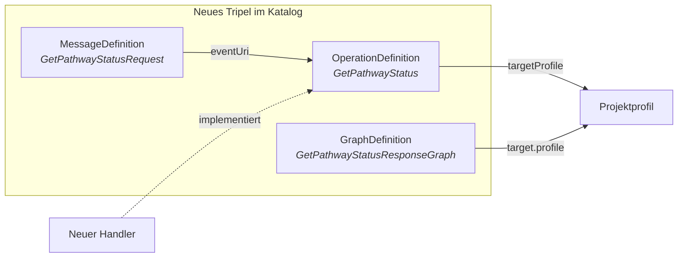

# Contributing

> Version 0.1.0 · 2026-05-01

Dieses Dokument beschreibt, wie der Query Broker weiterentwickelt, getestet und um projektspezifische Operationen erweitert wird.

---

## 1. Entwicklungsumgebung einrichten

```bash
git clone https://github.com/[org]/pds-query-broker.git
cd pds-query-broker
docker compose up -d    # RabbitMQ (5672), Katalog-Server (8090), Mock-THS (8091)
./gradlew build
```

---

## 2. Einen PDS-Connector implementieren

### Schritt 1: Stub generieren

```bash
asyncapi generate fromTemplate specs/pds-connector-base.yaml \
  @asyncapi/java-spring-template -o ./connectors/pds-mein-standort
```

### Schritt 2: Konfiguration

```yaml
pds:
  connector:
    pds-id: "PDS-MEIN-STANDORT"
    gpas-domain: "https://ths.example.org/gpas/domain/PDS-MEIN-STANDORT"
    catalog-url: "https://catalog.example.org/fhir"

spring:
  rabbitmq:
    host: rabbitmq.example.org
    port: 5672
    username: ${RABBITMQ_USER}
    password: ${RABBITMQ_PASS}
    listener:
      simple:
        queue: "req.PDS-MEIN-STANDORT"

ths:
  local:
    gpas-url: "https://ths.mein-standort.de/gpas"
```

### Schritt 3: Handler implementieren

> Die Handler-Ausgabe muss dem in `targetProfile` deklarierten Profil entsprechen (sofern eines konfiguriert ist). Der Stub validiert vor dem Versand. Ohne `targetProfile` entfällt die Validierung.

```java
@Component
public class OmopConditionHandler implements OperationHandler {

    private final OmopCdmClient omop;
    private final LocalThsClient localThs;
    private final ConditionFhirMapper mapper;

    @Override
    public Bundle execute(String pseudonym, Parameters parameters) {
        var personId = localThs.resolveToInternalId(pseudonym);
        var dateFrom = extractOptionalDate(parameters, "dateFrom");
        var icdCode = extractOptionalString(parameters, "icdCode");

        var fhirConditions = omop.queryConditionOccurrence(
            OmopConditionQuery.builder()
                .personId(personId).dateFrom(dateFrom).icdCode(icdCode).build()
        ).stream().map(mapper::toFhirCondition).toList();

        return FhirBundleBuilder.searchSet(fhirConditions);
    }
}
```

> Falls ein Profil konfiguriert ist (z.B. MII KDS Diagnose), fordert dieses typischerweise spezifische CodeSystem-Bindungen, Pflichtfelder und Extensions. Die konkreten Anforderungen ergeben sich aus dem jeweiligen `targetProfile`.

### Schritt 4: Handler registrieren

```java
@Component
public class MeinStandortConnector extends AbstractPdsConnector {

    @Override
    public String getPdsId() { return "PDS-MEIN-STANDORT"; }

    @Override
    public Map<String, OperationHandler> getHandlers() {
        return Map.of(
            "GetConditions",  conditionHandler,
            "GetLabResults",  labResultHandler
        );
    }
}
```

> Keys in der Handler-Map verwenden den FHIR-konformen PascalCase-Namen der OperationDefinition (z.B. `GetConditions`, nicht `GET_CONDITIONS`).

### Schritt 5: RabbitMQ-Queue + Connector starten

```bash
rabbitmqadmin declare queue name=req.PDS-MEIN-STANDORT durable=true \
  arguments='{"x-dead-letter-exchange":"pds.dlq"}'
rabbitmqadmin declare binding source=pds.broadcast destination=req.PDS-MEIN-STANDORT

cd connectors/pds-mein-standort
./gradlew bootRun
curl https://pds-mein-standort.example.org/connector/metadata | jq .messaging
```

---

## 3. Konformitätstests ausführen

```bash
./gradlew :conformance:test \
  -PopDefinition=GetConditions \
  -PcatalogUrl=http://localhost:8090/fhir \
  -PconnectorClass=com.example.MeinStandortConnector \
  -PtestdataSet=./catalog/testdata/GetConditions/v1.0
```

**Erwartete Ausgabe:**

```console
GetConditions v1.0 — Konformitätstest für PDS-MEIN-STANDORT
────────────────────────────────────────────────────────────
  synthetic-patient-001:
    ✅ FHIR R4 Message Bundle valide
    ✅ MessageHeader.response.code = ok
    ✅ Condition.meta.profile → konfiguriertes Profil
    ✅ Condition.code verwendet ICD-10-GM
    ✅ GraphDefinition: Encounter konform zu konfiguriertem Profil
    ❌ Condition.recordedDate fehlt in 2/3 Ergebnissen
       → Pflichtfeld laut konfiguriertem Profil
```

---

## 4. Projektspezifische Operationen definieren

### Artefakte pro Operation



### Beispiel: `GetPathwayStatus`

> OperationDefinition-Namen folgen dem FHIR-Namensschema: PascalCase, Constraint opd-0 (vgl. [FHIR R4 OperationDefinition](https://hl7.org/fhir/R4/operationdefinition.html)).

**OperationDefinition** (`catalog/OperationDefinition/GetPathwayStatus.json`):

```json
{
  "resourceType": "OperationDefinition",
  "url": "https://mihub.example.org/fhir/OperationDefinition/GetPathwayStatus",
  "name": "GetPathwayStatus",
  "version": "1.0",
  "status": "active",
  "kind": "operation",
  "resource": ["CarePlan"],
  "parameter": [
    {
      "name": "pseudonym",
      "use": "in",
      "min": 1,
      "max": "*",
      "type": "Identifier"
    },
    {
      "name": "pathwayId",
      "use": "in",
      "min": 1,
      "max": "1",
      "type": "string"
    },
    {
      "name": "includeHistory",
      "use": "in",
      "min": 0,
      "max": "1",
      "type": "boolean"
    },
    {
      "name": "return",
      "use": "out",
      "min": 1,
      "max": "1",
      "type": "Bundle",
      "part": [
        {
          "name": "carePlan",
          "use": "out",
          "min": 0,
          "max": "*",
          "type": "CarePlan",
          "targetProfile": ["http://hl7.org/fhir/StructureDefinition/CarePlan"]
        }
      ]
    }
  ]
}
```

**MessageDefinition** (`catalog/MessageDefinition/GetPathwayStatusRequest.json`):

```json
{
  "resourceType": "MessageDefinition",
  "url": "https://mihub.example.org/fhir/MessageDefinition/GetPathwayStatusRequest",
  "status": "active",
  "eventUri": "https://mihub.example.org/fhir/OperationDefinition/GetPathwayStatus",
  "category": "consequence",
  "focus": [{ "code": "Parameters", "min": 1, "max": "1" }],
  "responseRequired": "always",
  "allowedResponse": [
    {
      "message": "https://mihub.example.org/fhir/MessageDefinition/GetPathwayStatusResponse"
    },
    {
      "message": "https://mihub.example.org/fhir/MessageDefinition/OperationError"
    }
  ]
}
```

**Katalog aktualisieren + Handler registrieren:**

```bash
curl -X POST https://catalog.example.org/fhir/OperationDefinition \
  -H "Content-Type: application/fhir+json" -d @catalog/OperationDefinition/GetPathwayStatus.json
# analog für MessageDefinition und GraphDefinition
```

```java
@Override
public Map<String, OperationHandler> getHandlers() {
    return Map.of(
        "GetConditions",      conditionHandler,
        "GetLabResults",      labResultHandler,
        "GetPathwayStatus",   pathwayStatusHandler
    );
}
```

### Checkliste

- [ ] OperationDefinition: `name` in PascalCase, `url` kanonisch, `return.part[].targetProfile` gesetzt (optional)
- [ ] MessageDefinition (Request): `eventUri` → OperationDefinition, `allowedResponse` vollständig
- [ ] MessageDefinition (Response): `focus.profile` → Projektprofil (falls konfiguriert)
- [ ] GraphDefinition: `target.profile` für alle Knoten
- [ ] Testdaten-Set mit mindestens zwei synthetischen Patienten
- [ ] Konformitätstests bestanden

---

## 5. Broker und SDK weiterentwickeln

### Broker-Kernklassen

| Klasse                      | Verantwortlichkeit                                                                |
| --------------------------- | --------------------------------------------------------------------------------- |
| `MessageDefinitionRegistry` | Katalog laden, FHIR Messages validieren                                           |
| `CapabilityRouter`          | Routing via Pseudonym-Map + CapabilityStatement.messaging                         |
| `QueryBrokerService`        | Fan-out, correlationId                                                            |
| `ResponseAggregator`        | Korrelation via `MessageHeader.response.identifier`, Timeout → `OperationOutcome` |

### SDK-Kernklassen

| Klasse                         | Verantwortlichkeit                                                     |
| ------------------------------ | ---------------------------------------------------------------------- |
| `AbstractPdsConnector`         | FHIR Message Parsing, Pseudonym-Filtering, Dispatch, Profilvalidierung |
| `OperationHandler`             | `Bundle execute(String pseudonym, Parameters params)`                  |
| `FhirProfileValidator`         | Validierung gegen konfigurierte StructureDefinitions + GraphDefinition |
| `CapabilityStatementGenerator` | Generiert CapabilityStatement aus Handler-Map                          |

> FHIR-Profilpakete werden als Dependency im SDK eingebunden — welche Pakete, hängt vom Projektkontext ab.

---

## 6. Code-Konventionen

- Java 17+, Spring Boot, HAPI FHIR, JUnit 5 + AssertJ, Testcontainers
- [Conventional Commits](https://www.conventionalcommits.org/) — Scopes: `broker`, `connector-sdk`, `conformance`, `catalog`, `specs`, `docs`
- Branches: `main` (stabil), `develop`, `feature/*`, `release/*`

---

## 7. Release-Prozess

| Komponente          | Versionierung                           |
| ------------------- | --------------------------------------- |
| Broker / SDK        | Semver                                  |
| AsyncAPI Spec       | Semver (info.version)                   |
| OperationDefinition | Semver (version-Feld)                   |
| MessageDefinition   | Gebunden an OperationDefinition-Version |

**Kompatibilitätsgarantien:** AsyncAPI Major nur bei Breaking Changes. SDK Minor Drop-in. OperationDefinitions additiv (neue optionale Parameter). Breaking Changes → neue Operation oder Major-Version.
