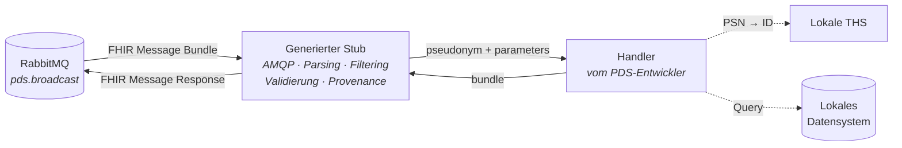
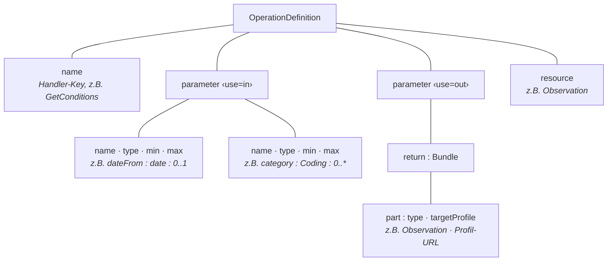
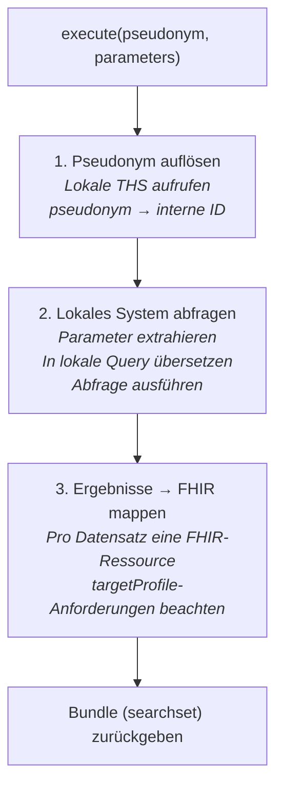
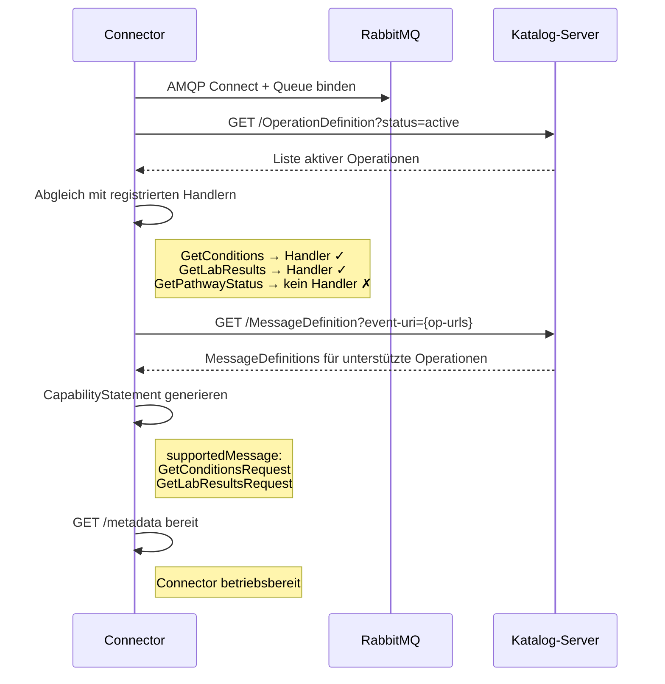

# PDS-Integrationsleitfaden

> Version 0.1.0 · 2026-05-01

Dieses Dokument beschreibt den sprachagnostischen Implementierungspfad für PDS-Entwickler, die einen Connector für den Query Broker bereitstellen. Es ist unabhängig von Programmiersprache, lokalem Datensystem und Pseudonymisierungsinfrastruktur.

> Für die Weiterentwicklung von Broker, SDK und Nachrichtenkatalog siehe [CONTRIBUTING.md](CONTRIBUTING.md). Für die Gesamtarchitektur siehe [ARCHITECTURE.md](docs/ARCHITECTURE.md).

---

## Inhaltsverzeichnis

1. [Überblick: Was ein PDS-Connector ist](#1-überblick-was-ein-pds-connector-ist)
2. [Voraussetzungen](#2-voraussetzungen)
3. [Stub generieren](#3-stub-generieren)
4. [Konfiguration](#4-konfiguration)
5. [OperationDefinition lesen und verstehen](#5-operationdefinition-lesen-und-verstehen)
6. [Handler implementieren](#6-handler-implementieren)
7. [Handler registrieren](#7-handler-registrieren)
8. [RabbitMQ-Queue einrichten](#8-rabbitmq-queue-einrichten)
9. [Connector starten und verifizieren](#9-connector-starten-und-verifizieren)
10. [Konformitätstests](#10-konformitätstests)
11. [Neue Operationen unterstützen](#11-neue-operationen-unterstützen)

---

## 1. Überblick: Was ein PDS-Connector ist

Ein PDS-Connector ist ein eigenständiger Dienst, der am PDS-Standort betrieben wird. Er empfängt FHIR Message Bundles über RabbitMQ, führt Operationen gegen das lokale Datensystem aus und liefert FHIR-konforme Ergebnisse zurück.



### Aufgabenteilung

| Aufgabe | Verantwortung |
|---------|---------------|
| AMQP-Verbindung, Queue-Binding, Message-Empfang | Generierter Stub |
| FHIR Message Bundle deserialisieren, `MessageHeader.eventUri` auswerten | Generierter Stub |
| Pseudonym-Filtering (gPAS-Domäne prüfen) | Generierter Stub |
| Capability-Check (Handler registriert?) | Generierter Stub |
| `Parameters`-Ressource extrahieren und an Handler übergeben | Generierter Stub |
| **Pseudonym → interne ID auflösen** | **PDS-Entwickler (Handler)** |
| **Lokales Datensystem abfragen** | **PDS-Entwickler (Handler)** |
| **Lokale Daten → FHIR-Ressourcen mappen** | **PDS-Entwickler (Handler)** |
| **FHIR Bundle zusammenbauen und zurückgeben** | **PDS-Entwickler (Handler)** |
| Handler-Ergebnis gegen `targetProfile` validieren | Generierter Stub |
| Provenance und AuditEvent erzeugen | Generierter Stub |
| FHIR Message Response verpacken und via AMQP senden | Generierter Stub |
| CapabilityStatement generieren und unter `/metadata` publizieren | Generierter Stub |

---

## 2. Voraussetzungen

| Voraussetzung | Zweck |
|---------------|-------|
| AsyncAPI CLI | Stub-Generierung aus der AsyncAPI Base-Spec |
| FHIR-Bibliothek der Zielsprache | FHIR-Ressourcen erzeugen und serialisieren |
| AMQP-Client der Zielsprache | Wird vom generierten Stub verwendet |
| Netzwerkzugang zum RabbitMQ Broker | Ausgehende AMQP-Verbindung (Port 5672) |
| Netzwerkzugang zum Katalog-Server | FHIR REST (HTTPS) für Katalog-Abruf |
| Netzwerkzugang zur lokalen THS | REST-API für Pseudonym-Auflösung |
| Zugang zum lokalen Datensystem | SQL, REST, HL7 v2, Datei — je nach System |

**FHIR-Bibliotheken nach Sprache:**

| Sprache | Bibliothek |
|---------|------------|
| Java | [HAPI FHIR](https://hapifhir.io/) |
| Python | [fhir.resources](https://pypi.org/project/fhir.resources/) |
| TypeScript / JavaScript | [fhir-kit-client](https://github.com/Vermonster/fhir-kit-client) oder native JSON |
| Go | [samply/golang-fhir-models](https://github.com/samply/golang-fhir-models) |
| C# / .NET | [Hl7.Fhir.R4](https://github.com/FirelyTeam/firely-net-sdk) |

---

## 3. Stub generieren

Die AsyncAPI Base-Spec (`specs/pds-connector-base.yaml`) definiert die AMQP-Topologie und den Content-Type (`application/fhir+json`). Aus dieser Spec wird ein sprachspezifischer Stub generiert:

```bash
asyncapi generate fromTemplate specs/pds-connector-base.yaml \
  @asyncapi/{template} \
  -o ./connectors/pds-mein-standort
```

> Verfügbare Templates: `java-spring`, `python-paho`, `nodejs`, `go-watermill` u.a. Alternativ kann ein Template-Projekt der gewünschten Sprache kopiert werden: `cp -r connectors/pds-example-{sprache} connectors/pds-mein-standort`

Der generierte Stub enthält folgende Module:

| Modul | Verantwortlichkeit | Manuell ändern? |
|-------|-------------------|-----------------|
| `amqp_listener` | AMQP-Verbindung, Queue-Binding | Nein |
| `message_parser` | FHIR Message Bundle Deserialisierung | Nein |
| `pseudonym_filter` | gPAS-Domäne aus Parameters extrahieren | Nein |
| `capability_check` | Handler-Registrierung prüfen | Nein |
| `profile_validator` | `targetProfile`-Validierung | Nein |
| `provenance_builder` | Provenance + AuditEvent erzeugen | Nein |
| `response_builder` | FHIR Message Response zusammenbauen | Nein |
| `handlers/` | **Hier implementiert der PDS-Entwickler** | **Ja** |
| `config.yaml.template` | Konfigurationsvorlage | Ja (kopieren + anpassen) |

---

## 4. Konfiguration

Konfigurationsdatei anlegen (identisch über alle Sprachen):

```yaml
pds:
  connector:
    pds-id: "PDS-MEIN-STANDORT"
    gpas-domain: "https://ths.example.org/gpas/domain/PDS-MEIN-STANDORT"
    catalog-url: "https://catalog.example.org/fhir"
    catalog-refresh-interval: 3600

amqp:
  host: rabbitmq.example.org
  port: 5672
  queue: "req.PDS-MEIN-STANDORT"
  username: ${RABBITMQ_USER}
  password: ${RABBITMQ_PASS}
  response-queue: "responses.default"

ths:
  local:
    url: "https://ths.mein-standort.de/api"
```

| Parameter | Bedeutung |
|-----------|-----------|
| `pds-id` | Eindeutiger Identifier des PDS-Standorts |
| `gpas-domain` | URI der gPAS-Domäne — Stub filtert eingehende Nachrichten nach Pseudonymen mit dieser Domäne |
| `catalog-url` | FHIR REST Endpunkt des Katalog-Servers |
| `catalog-refresh-interval` | Intervall in Sekunden, in dem der Stub den Katalog auf neue/geänderte Operationen prüft |
| `amqp.queue` | Name der RabbitMQ-Queue, an die der Fanout Exchange Nachrichten liefert |

---

## 5. OperationDefinition lesen und verstehen

Vor der Implementierung eines Handlers muss der PDS-Entwickler die OperationDefinition der gewünschten Operation kennen. Sie ist über den Katalog-Server oder den publizierten ImplementationGuide (HTML) abrufbar:

```bash
curl https://catalog.example.org/fhir/OperationDefinition?status=active | jq '.entry[].resource.name'
curl https://catalog.example.org/fhir/OperationDefinition/GetConditions | jq .
```

Die für die Implementierung relevanten Informationen einer OperationDefinition:



> `targetProfile` ist die zentrale Information für den Mapper: Es bestimmt, welche Pflichtfelder, CodeSystem-Bindungen und Extensions die erzeugten FHIR-Ressourcen haben müssen. Der Stub validiert das Handler-Ergebnis gegen dieses Profil vor dem Versand.

---

## 6. Handler implementieren

### Handler-Vertrag

Der Stub ruft den Handler mit zwei Argumenten auf und erwartet ein FHIR Bundle als Rückgabe:

```pseudocode
function execute(pseudonym: String, parameters: FHIR.Parameters): FHIR.Bundle
    throws OperationError
```

| Element | Typ | Beschreibung |
|---------|-----|-------------|
| `pseudonym` (Eingabe) | String | Das Pseudonym, das zur konfigurierten gPAS-Domäne passt. Vom Stub aus der `Parameters`-Ressource extrahiert. |
| `parameters` (Eingabe) | FHIR Parameters | Typisierte Eingabeparameter (ohne Pseudonym-Einträge — diese hat der Stub bereits verarbeitet). |
| Rückgabe | FHIR Bundle | Type `searchset`, enthält die fachlichen Ergebnis-Ressourcen. |
| Fehler | OperationError | Wird vom Stub in ein FHIR `OperationOutcome` übersetzt. |

### Drei Teilaufgaben

Jeder Handler hat dieselbe innere Struktur — unabhängig von Sprache und Datensystem:



> Die Implementierung der Teilaufgaben 1 und 2 ist standortspezifisch und hängt von der lokalen Infrastruktur ab. Der Stub macht keine Annahmen über das lokale Datensystem oder die THS-API.

### Parameter extrahieren

Die `Parameters`-Ressource enthält typisierte FHIR-Einträge. Die Extraktion folgt in jeder Sprache demselben Muster:

1. Für jeden Parameter in der OperationDefinition (`use=in`, `name≠pseudonym`): den Eintrag mit passendem `name` in `parameters.parameter[]` suchen.
2. Den typisierten Wert lesen: `valueDate`, `valueString`, `valueCoding` etc.
3. Bei optionalen Parametern (`min=0`), die nicht vorhanden sind: Default-Wert verwenden oder leer lassen.
4. Bei Pflichtparametern (`min=1`), die nicht vorhanden sind: Der Stub hat dies bereits vor dem Handler-Aufruf validiert.

Typische Parameter und ihre FHIR-Datentypen:

| Parametername | FHIR-Typ | Typische Verwendung |
|---------------|----------|---------------------|
| `dateFrom` | `date` | Zeitliche Filterung (ab Datum) |
| `dateTo` | `date` | Zeitliche Filterung (bis Datum) |
| `category` | `Coding` | Kategoriefilter (`system` + `code`) |
| `code` | `string` oder `Coding` | Code-basierte Filterung (ICD, LOINC, OPS ...) |
| `includeHistory` | `boolean` | Flag für historische Daten |

### FHIR-Ressourcen erzeugen

Pro Ergebnis-Datensatz aus dem lokalen System wird eine FHIR-Ressource erzeugt. Die Anforderungen ergeben sich aus dem FHIR-Basis-Ressourcentyp und dem `targetProfile`:

1. Ressource instanziieren (Observation, Condition, Procedure etc.)
2. Pflichtfelder setzen (aus FHIR-Basis + `targetProfile`): `status`, `code` (mit CodeSystem-Binding aus dem Profil), Zeitbezug (`effective[x]`, `onset[x]`, `performed[x]`)
3. Werte und Einheiten setzen (`value[x]`, Einheit als UCUM-Code falls vom Profil gefordert)
4. CodeSystem-Bindungen einhalten: Profil fordert z.B. LOINC für `code` → lokalen Code auf LOINC mappen
5. `meta.source` auf die Connector-URL setzen (leichtgewichtige Herkunftsmarkierung)
6. `meta.profile` auf die kanonische URL des `targetProfile` setzen

### Bundle zusammenbauen

```pseudocode
bundle = new Bundle(type = "searchset")
for each fhirResource:
    entry = new BundleEntry()
    entry.fullUrl = "urn:uuid:" + randomUUID()
    entry.resource = fhirResource
    bundle.entry.add(entry)
return bundle
```

---

## 7. Handler registrieren

Der Stub erwartet eine Zuordnung von Operationsnamen zu Handler-Funktionen. Der Key ist der `name` aus der OperationDefinition (PascalCase, z.B. `GetConditions`):

```pseudocode
handlers = {
    "GetConditions":  conditionsHandler,
    "GetLabResults":  labResultsHandler,
    "GetProjectData": projectDataHandler
}
```

> Der Stub extrahiert den Operationsnamen aus `MessageHeader.eventUri` (letztes Pfadsegment der kanonischen URL) und sucht in der Handler-Map. Nicht registrierte Operationen werden mit `OperationOutcome` (`code: not-supported`) beantwortet.

---

## 8. RabbitMQ-Queue einrichten

Eine Queue für den Connector deklarieren und an den Fanout Exchange binden:

```bash
rabbitmqadmin declare queue \
  name=req.PDS-MEIN-STANDORT \
  durable=true \
  arguments='{"x-dead-letter-exchange":"pds.dlq"}'

rabbitmqadmin declare binding \
  source=pds.broadcast \
  destination=req.PDS-MEIN-STANDORT
```

> Die Verbindungsrichtung ist **ausgehend** vom PDS zum RabbitMQ Broker — keine eingehenden Verbindungen in das PDS-Netz nötig.

---

## 9. Connector starten und verifizieren

Der Start erfolgt sprachspezifisch (z.B. `./gradlew bootRun`, `python main.py`, `npm start`, `go run .`).

Verifizierung:

```bash
# CapabilityStatement prüfen — listet unterstützte Operationen
curl https://pds-mein-standort.example.org/connector/metadata \
  | jq '.messaging[0].supportedMessage'

# Queue-Status prüfen — Connector als Consumer sichtbar
rabbitmqadmin list queues name messages consumers
```

### Connector-Startup-Flow



---

## 10. Konformitätstests

### Testdimensionen

| Dimension | Prüft | Verantwortung |
|-----------|-------|---------------|
| Strukturell | Ist die Handler-Ausgabe valides FHIR? Entspricht sie dem `targetProfile`? | Stub (automatisch vor Versand) + Konformitätstest-Framework |
| Semantisch | Stimmen CodeSysteme, Pflichtfelder, Referenzen? | Konformitätstest-Framework + Testdaten |
| Operativ | Antwortet der Connector korrekt auf Broadcasts, Timeouts, unbekannte Operationen? | Mock-Broker-Integrationstests |

### Konformitätstests ausführen

```bash
./conformance-test \
  --operation GetConditions \
  --catalog-url https://catalog.example.org/fhir \
  --connector-url https://pds-mein-standort.example.org/connector \
  --testdata ./catalog/testdata/GetConditions/v1.0
```

### Testdaten-Struktur

Synthetische Testdaten werden pro Operation und Version bereitgestellt:

| Pfad | Inhalt |
|------|--------|
| `catalog/testdata/GetConditions/v1.0/` | Testdaten-Set für Operation `GetConditions`, Version 1.0 |
| `synthetic-patient-NNN/input-data.*` | Testdaten für das lokale System (Format je nach System) |
| `synthetic-patient-NNN/query-params.json` | FHIR Parameters für die Testanfrage |
| `synthetic-patient-NNN/expected/min-cardinality.json` | Mindest-Kardinalitäten im Ergebnis |
| `synthetic-patient-NNN/expected/coding-systems.json` | Erlaubte und verbotene CodeSysteme |

### Erwartete Konsolenausgabe

```console
GetConditions v1.0 — Konformitätstest für PDS-MEIN-STANDORT
────────────────────────────────────────────────────────────
  synthetic-patient-001:
    ✅ Response ist valides FHIR R4 Message Bundle
    ✅ MessageHeader.response.code = ok
    ✅ Ergebnis-Ressourcen entsprechen targetProfile
    ✅ CodeSysteme profilkonform
    ✅ Provenance vorhanden (agent = PDS-MEIN-STANDORT)
    ❌ Observation.effective fehlt in 1/3 Ergebnissen
       → Pflichtfeld laut targetProfile
```

---

## 11. Neue Operationen unterstützen

Wenn eine neue OperationDefinition im Katalog erscheint:

1. **Katalog prüfen** — Der Connector erkennt die neue Operation beim nächsten Refresh und antwortet mit `OperationOutcome` (`not-supported`) bis ein Handler vorhanden ist.
2. **OperationDefinition lesen** — Parameter, `targetProfile` und zugehörige GraphDefinition verstehen (→ [Abschnitt 5](#5-operationdefinition-lesen-und-verstehen)).
3. **Handler implementieren** — Drei Teilaufgaben: THS-Auflösung, lokale Query, FHIR-Mapping (→ [Abschnitt 6](#6-handler-implementieren)).
4. **Handler registrieren** — Eintrag in der Handler-Map ergänzen (→ [Abschnitt 7](#7-handler-registrieren)).
5. **Connector deployen** — Der Stub erkennt den neuen Handler, aktualisiert das CapabilityStatement. Der Broker erkennt die neue `supportedMessage` beim nächsten `/metadata`-Abruf.
6. **Konformitätstests ausführen** — Testdaten für die neue Operation verwenden (→ [Abschnitt 10](#10-konformitätstests)).

> Der Broker, die AsyncAPI-Spec, die RabbitMQ-Queue und alle anderen Connectoren bleiben unverändert. Die einzige Änderung liegt im Connector des PDS, das die neue Operation unterstützen will.

---

## Referenzen

| Thema | Quelle |
|-------|--------|
| AsyncAPI Spec | [AsyncAPI 3.0 Specification](https://www.asyncapi.com/docs/reference/specification/v3.0.0) |
| FHIR Messaging | [HL7 FHIR R4 Messaging](https://hl7.org/fhir/R4/messaging.html) |
| OperationDefinition | [HL7 FHIR R4 OperationDefinition](https://hl7.org/fhir/R4/operationdefinition.html) |
| MessageDefinition | [HL7 FHIR R4 MessageDefinition](https://hl7.org/fhir/R4/messagedefinition.html) |
| GraphDefinition | [HL7 FHIR R4 GraphDefinition](https://hl7.org/fhir/R4/graphdefinition.html) |
| CapabilityStatement | [HL7 FHIR R4 CapabilityStatement](https://hl7.org/fhir/R4/capabilitystatement.html) |
| Provenance | [HL7 FHIR R4 Provenance](https://hl7.org/fhir/R4/provenance.html) |
| AuditEvent | [HL7 FHIR R4 AuditEvent](https://hl7.org/fhir/R4/auditevent.html) |
| FHIR Shorthand (FSH) | [FSH School](https://fshschool.org/) |
| Gesamtarchitektur | [ARCHITECTURE.md](docs/ARCHITECTURE.md) |
| Broker/SDK-Entwicklung | [CONTRIBUTING.md](CONTRIBUTING.md) |
