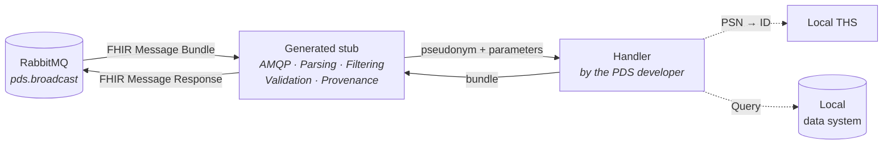
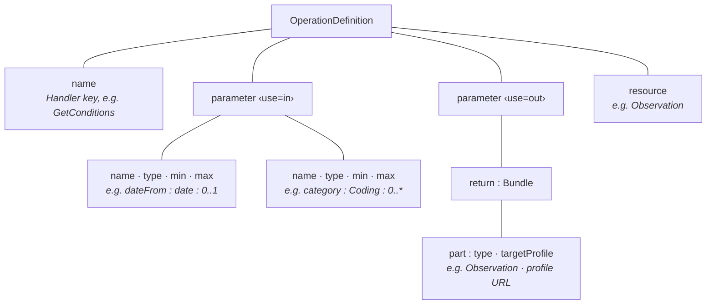
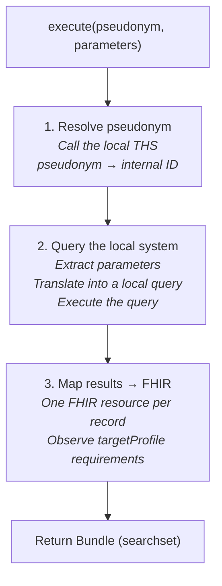
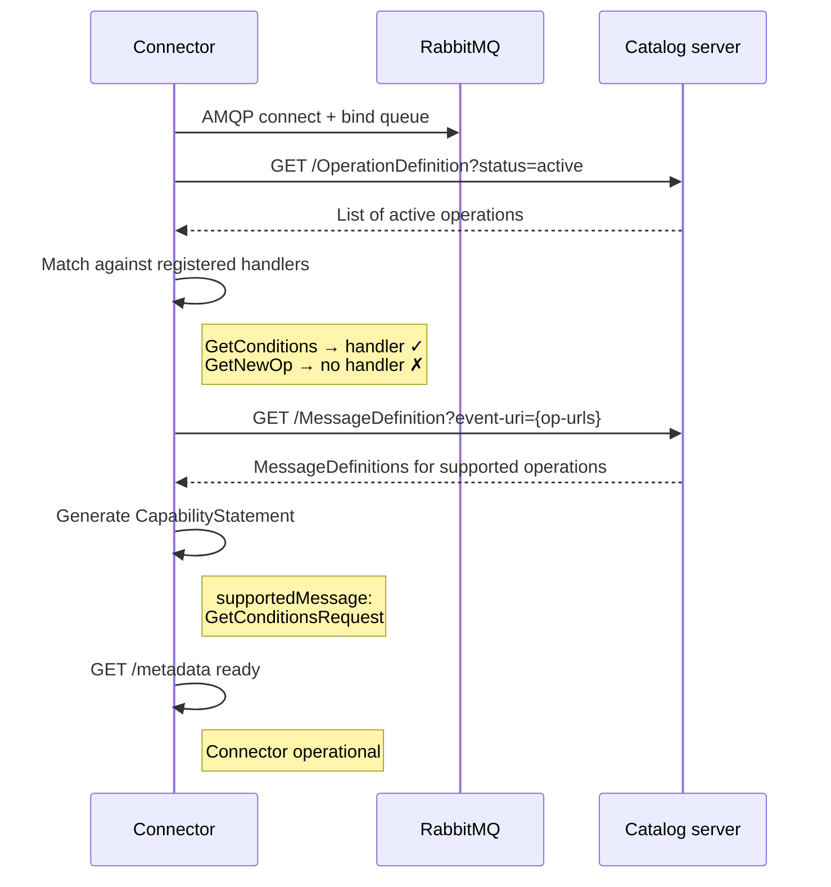

# PDS Integration Guide

> Version 0.2.0 · 2026-05-04

This document describes the language-agnostic implementation path for PDS developers providing a connector for the Query Broker. It is independent of programming language, local data system, and pseudonymization infrastructure.

> For further development of the broker, SDK, and message catalog, see [CONTRIBUTING.md](CONTRIBUTING.md). For the overall architecture, see [ARCHITECTURE.md](docs/ARCHITECTURE.md).

---

## Table of Contents

1. [Overview: What a PDS connector is](#1-overview-what-a-pds-connector-is)
2. [Prerequisites](#2-prerequisites)
3. [Generating the stub](#3-generating-the-stub)
4. [Configuration](#4-configuration)
5. [Reading and understanding the OperationDefinition](#5-reading-and-understanding-the-operationdefinition)
6. [Implementing a handler](#6-implementing-a-handler)
7. [Registering a handler](#7-registering-a-handler)
8. [Setting up the RabbitMQ queue](#8-setting-up-the-rabbitmq-queue)
9. [Starting and verifying the connector](#9-starting-and-verifying-the-connector)
10. [Conformance tests](#10-conformance-tests)
11. [Supporting new operations](#11-supporting-new-operations)

---

## 1. Overview: What a PDS connector is

A PDS connector is a standalone service operated at the site of the primary data source (PDS). It receives FHIR Message Bundles via RabbitMQ, executes operations against the local data system, and returns FHIR-conformant results.



### Division of responsibilities

| Task | Responsibility |
|---------|---------------|
| AMQP connection, queue binding, message reception | Generated stub |
| Deserializing the FHIR Message Bundle, evaluating `MessageHeader.eventUri` | Generated stub |
| Pseudonym filtering (checking the gPAS domain) | Generated stub |
| Capability check (handler registered?) | Generated stub |
| Extracting the `Parameters` resource and passing it to the handler | Generated stub |
| **Resolving pseudonym → internal ID** | **PDS developer (handler)** |
| **Querying the local data system** | **PDS developer (handler)** |
| **Mapping local data → FHIR resources** | **PDS developer (handler)** |
| **Assembling and returning the FHIR Bundle** | **PDS developer (handler)** |
| Validating the handler result against the `targetProfile` | Generated stub |
| Creating Provenance and AuditEvent | Generated stub |
| Packaging the FHIR Message Response and sending it via AMQP | Generated stub |
| Generating the CapabilityStatement and publishing it under `/metadata` | Generated stub |

---

## 2. Prerequisites

| Prerequisite | Purpose |
|---------------|-------|
| AsyncAPI CLI | Stub generation from the AsyncAPI base spec |
| FHIR library for the target language | Creating and serializing FHIR resources |
| AMQP client for the target language | Used by the generated stub |
| Network access to the RabbitMQ broker | Outbound AMQP connection (port 5672) |
| Network access to the catalog server | FHIR REST (HTTPS) for catalog retrieval |
| Network access to the local THS | REST API for pseudonym resolution |
| Access to the local data system | SQL, REST, HL7 v2, file — depending on the system |

**FHIR libraries by language:**

| Language | Library |
|---------|------------|
| Java | [HAPI FHIR](https://hapifhir.io/) |
| Python | [fhir.resources](https://pypi.org/project/fhir.resources/) |
| TypeScript / JavaScript | [fhir-kit-client](https://github.com/Vermonster/fhir-kit-client) or native JSON |
| Go | [samply/golang-fhir-models](https://github.com/samply/golang-fhir-models) |
| C# / .NET | [Hl7.Fhir.R4](https://github.com/FirelyTeam/firely-net-sdk) |

---

## 3. Generating the stub

The AsyncAPI base spec (`specs/pds-connector-base.yaml`) defines the AMQP topology and the content type (`application/fhir+json`). A language-specific stub is generated from this spec:

```bash
asyncapi generate fromTemplate specs/pds-connector-base.yaml \
  @asyncapi/{template} \
  -o ./connectors/pds-my-site
```

> Available templates: `java-spring`, `python-paho`, `nodejs`, `go-watermill`, among others. Alternatively, a template project in the desired language can be copied: `cp -r connectors/pds-example-{sprache} connectors/pds-my-site`

The generated stub contains the following modules:

| Module | Responsibility | Modify manually? |
|-------|-------------------|-----------------|
| `amqp_listener` | AMQP connection, queue binding | No |
| `message_parser` | FHIR Message Bundle deserialization | No |
| `pseudonym_filter` | Extracting the gPAS domain from Parameters | No |
| `capability_check` | Checking handler registration | No |
| `profile_validator` | `targetProfile` validation | No |
| `provenance_builder` | Creating Provenance + AuditEvent | No |
| `response_builder` | Assembling the FHIR Message Response | No |
| `handlers/` | **This is where the PDS developer implements** | **Yes** |
| `config.yaml.template` | Configuration template | Yes (copy + adapt) |

---

## 4. Configuration

Create a configuration file (identical across all languages):

```yaml
pds:
  connector:
    pds-id: "PDS-MY-SITE"
    gpas-domain: "https://ths.example.org/gpas/domain/PDS-MY-SITE"
    catalog-url: "https://catalog.example.org/fhir"
    catalog-refresh-interval: 3600

amqp:
  host: rabbitmq.example.org
  port: 5672
  queue: "req.PDS-MY-SITE"
  username: ${RABBITMQ_USER}
  password: ${RABBITMQ_PASS}
  response-queue: "responses.default"

ths:
  local:
    url: "https://ths.mein-standort.de/api"
```

| Parameter | Meaning |
|-----------|-----------|
| `pds-id` | Unique identifier of the PDS site |
| `gpas-domain` | URI of the gPAS domain — the stub filters incoming messages for pseudonyms with this domain |
| `catalog-url` | FHIR REST endpoint of the catalog server |
| `catalog-refresh-interval` | Interval in seconds at which the stub checks the catalog for new/changed operations |
| `amqp.queue` | Name of the RabbitMQ queue to which the Fanout Exchange delivers messages |

---

## 5. Reading and understanding the OperationDefinition

Before implementing a handler, the PDS developer must know the OperationDefinition of the desired operation. It can be retrieved via the catalog server or the published ImplementationGuide (HTML):

```bash
curl https://catalog.example.org/fhir/OperationDefinition?status=active | jq '.entry[].resource.name'
curl https://catalog.example.org/fhir/OperationDefinition/GetConditions | jq .
```

The information in an OperationDefinition relevant for implementation:



> `targetProfile` is the key piece of information for the mapper: it determines which mandatory fields, CodeSystem bindings, and extensions the generated FHIR resources must have. The stub validates the handler result against this profile before sending.

---

## 6. Implementing a handler

### Handler contract

The stub calls the handler with two arguments and expects a FHIR Bundle as the return value:

```pseudocode
function execute(pseudonym: String, parameters: FHIR.Parameters): FHIR.Bundle
    throws OperationError
```

| Element | Type | Description |
|---------|-----|-------------|
| `pseudonym` (input) | String | The pseudonym matching the configured gPAS domain. Extracted by the stub from the `Parameters` resource. |
| `parameters` (input) | FHIR Parameters | Typed input parameters (without pseudonym entries — the stub has already processed these). |
| Return value | FHIR Bundle | Type `searchset`, contains the domain-level result resources. |
| Error | OperationError | Translated by the stub into a FHIR `OperationOutcome`. |

### Three subtasks

Every handler has the same internal structure — regardless of language and data system:



> The implementation of subtasks 1 and 2 is site-specific and depends on the local infrastructure. The stub makes no assumptions about the local data system or the THS API.

### Extracting parameters

The `Parameters` resource contains typed FHIR entries. Extraction follows the same pattern in every language:

1. For each parameter in the OperationDefinition (`use=in`, `name≠pseudonym`): find the entry with the matching `name` in `parameters.parameter[]`.
2. Read the typed value: `valueDate`, `valueString`, `valueCoding`, etc.
3. For optional parameters (`min=0`) that are not present: use a default value or leave empty.
4. For mandatory parameters (`min=1`) that are not present: the stub has already validated this before invoking the handler.

Typical parameters and their FHIR data types:

| Parameter name | FHIR type | Typical use |
|---------------|----------|---------------------|
| `dateFrom` | `date` | Temporal filtering (from date) |
| `dateTo` | `date` | Temporal filtering (until date) |
| `category` | `Coding` | Category filter (`system` + `code`) |
| `code` | `string` or `Coding` | Code-based filtering (ICD, LOINC, OPS ...) |
| `includeHistory` | `boolean` | Flag for historical data |

### Creating FHIR resources

One FHIR resource is created per result record from the local system. The requirements derive from the FHIR base resource type and the `targetProfile`:

1. Instantiate the resource (Observation, Condition, Procedure, etc.)
2. Set mandatory fields (from the FHIR base + `targetProfile`): `status`, `code` (with the CodeSystem binding from the profile), temporal reference (`effective[x]`, `onset[x]`, `performed[x]`)
3. Set values and units (`value[x]`, unit as a UCUM code if required by the profile)
4. Comply with CodeSystem bindings: e.g. the profile requires LOINC for `code` → map the local code to LOINC
5. Set `meta.source` to the connector URL (lightweight provenance marker)
6. Set `meta.profile` to the canonical URL of the `targetProfile`

### Assembling the Bundle

```pseudocode
bundle = new Bundle(type = "searchset")
for each fhirResource:
    entry = new BundleEntry()
    entry.fullUrl = "urn:uuid:" + randomUUID()
    entry.resource = fhirResource
    bundle.entry.add(entry)
return bundle
```

---

## 7. Registering a handler

The stub expects a mapping from operation names to handler functions. The key is the `name` from the OperationDefinition (PascalCase, e.g. `GetConditions`):

```pseudocode
handlers = {
    "GetConditions": conditionsHandler
    // register additional handlers here
}
```

> The stub extracts the operation name from `MessageHeader.eventUri` (last path segment of the canonical URL) and looks it up in the handler map. Unregistered operations are answered with an `OperationOutcome` (`code: not-supported`).

---

## 8. Setting up the RabbitMQ queue

Declare a queue for the connector and bind it to the Fanout Exchange:

```bash
rabbitmqadmin declare queue \
  name=req.PDS-MY-SITE \
  durable=true \
  arguments='{"x-dead-letter-exchange":"pds.dlq"}'

rabbitmqadmin declare binding \
  source=pds.broadcast \
  destination=req.PDS-MY-SITE
```

> The connection direction is **outbound** from the PDS to the RabbitMQ broker — no inbound connections into the PDS network are required.

---

## 9. Starting and verifying the connector

Startup is language-specific (e.g. `./gradlew bootRun`, `python main.py`, `npm start`, `go run .`).

Verification:

```bash
# Check the CapabilityStatement — lists supported operations
curl https://pds-my-site.example.org/connector/metadata \
  | jq '.messaging[0].supportedMessage'

# Check the queue status — connector visible as a consumer
rabbitmqadmin list queues name messages consumers
```

### Connector startup flow



---

## 10. Conformance tests

### Test dimensions

| Dimension | Checks | Responsibility |
|-----------|-------|---------------|
| Structural | Is the handler output valid FHIR? Does it conform to the `targetProfile`? | Stub (automatically before sending) + conformance test framework |
| Semantic | Are CodeSystems, mandatory fields, and references correct? | Conformance test framework + test data |
| Operational | Does the connector respond correctly to broadcasts, timeouts, unknown operations? | Mock-broker integration tests |

### Running conformance tests

```bash
./conformance-test \
  --operation GetConditions \
  --catalog-url https://catalog.example.org/fhir \
  --connector-url https://pds-my-site.example.org/connector \
  --testdata ./catalog/testdata/GetConditions/v1.0
```

### Test data structure

Synthetic test data is provided per operation and version:

| Path | Content |
|------|--------|
| `catalog/testdata/GetConditions/v1.0/` | Test data set for operation `GetConditions`, version 1.0 |
| `synthetic-patient-NNN/input-data.*` | Test data for the local system (format depends on the system) |
| `synthetic-patient-NNN/query-params.json` | FHIR Parameters for the test request |
| `synthetic-patient-NNN/expected/min-cardinality.json` | Minimum cardinalities in the result |
| `synthetic-patient-NNN/expected/coding-systems.json` | Allowed and forbidden CodeSystems |

### Expected console output

```console
GetConditions v1.0 — conformance test for PDS-MY-SITE
────────────────────────────────────────────────────────────
  synthetic-patient-001:
    ✅ Response is a valid FHIR R4 Message Bundle
    ✅ MessageHeader.response.code = ok
    ✅ Result resources conform to targetProfile
    ✅ CodeSystems conform to the profile
    ✅ Provenance present (agent = PDS-MY-SITE)
    ❌ Observation.effective missing in 1/3 results
       → mandatory field according to targetProfile
```

---

## 11. Supporting new operations

When a new OperationDefinition appears in the catalog:

1. **Check the catalog** — The connector detects the new operation at the next refresh and responds with `OperationOutcome` (`not-supported`) until a handler is available.
2. **Read the OperationDefinition** — Understand the parameters, `targetProfile`, and associated GraphDefinition (→ [Section 5](#5-reading-and-understanding-the-operationdefinition)).
3. **Implement the handler** — Three subtasks: THS resolution, local query, FHIR mapping (→ [Section 6](#6-implementing-a-handler)).
4. **Register the handler** — Add an entry to the handler map (→ [Section 7](#7-registering-a-handler)).
5. **Deploy the connector** — The stub detects the new handler and updates the CapabilityStatement. The broker detects the new `supportedMessage` at the next `/metadata` retrieval.
6. **Run conformance tests** — Use the test data for the new operation (→ [Section 10](#10-conformance-tests)).

> The broker, the AsyncAPI spec, the RabbitMQ queue, and all other connectors remain unchanged. The only change is in the connector of the PDS that wants to support the new operation.

---

## References

| Topic | Source |
|-------|--------|
| AsyncAPI Spec | [AsyncAPI 3.0 Specification](https://www.asyncapi.com/docs/reference/specification/v3.0.0) |
| FHIR Messaging | [HL7 FHIR R4 Messaging](https://hl7.org/fhir/R4/messaging.html) |
| OperationDefinition | [HL7 FHIR R4 OperationDefinition](https://hl7.org/fhir/R4/operationdefinition.html) |
| MessageDefinition | [HL7 FHIR R4 MessageDefinition](https://hl7.org/fhir/R4/messagedefinition.html) |
| GraphDefinition | [HL7 FHIR R4 GraphDefinition](https://hl7.org/fhir/R4/graphdefinition.html) |
| CapabilityStatement | [HL7 FHIR R4 CapabilityStatement](https://hl7.org/fhir/R4/capabilitystatement.html) |
| Provenance | [HL7 FHIR R4 Provenance](https://hl7.org/fhir/R4/provenance.html) |
| AuditEvent | [HL7 FHIR R4 AuditEvent](https://hl7.org/fhir/R4/auditevent.html) |
| FHIR Shorthand (FSH) | [FSH School](https://fshschool.org/) |
| Overall architecture | [ARCHITECTURE.md](docs/ARCHITECTURE.md) |
| Broker/SDK development | [CONTRIBUTING.md](CONTRIBUTING.md) |
