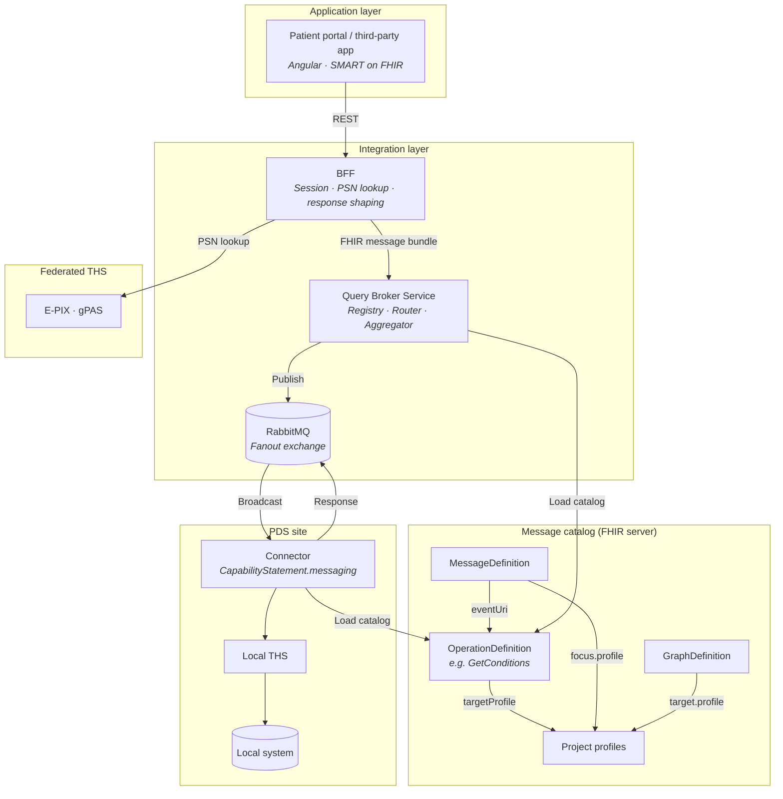

# Query Broker

> Version 0.10.0 <!-- x-release-please-version --> · [CHANGELOG](CHANGELOG.md)

**Federated query broker for integrating distributed primary data sources (PDS) via a patient portal and third-party applications.**

> **Status:** walking skeleton (increment 1, [ADR-011](docs/arc42/09_architecture_decisions.md#adr-011-staged-pilot-implementation--walking-skeleton-first)). The broker, connector SDK, and a synthetic reference connector run the `$GetConditions` loop end-to-end over the fanout topology — including catalog lookup, self-filtering, aggregation, and the timeout → `OperationOutcome` path. Not yet included (staged): profile validation, conformance harness, BFF, real THS, auth (see [docs/IMPLEMENTATION_PLAN.md](docs/IMPLEMENTATION_PLAN.md)).

---

## Overview

The Query Broker distributes data queries to multiple primary data sources, aggregates their responses, and returns normalized FHIR R4 Bundles — conformant to the profiles configured in the catalog. The architecture decouples transport (AMQP/RabbitMQ), operation semantics (FHIR OperationDefinition, MessageDefinition, GraphDefinition), and local data access (connector adapters) from one another.

### Design principles

- **FHIR Messaging** — All messages are FHIR R4 Bundles of type `message` (cf. [FHIR Messaging](https://hl7.org/fhir/R4/messaging.html)).
- **Stable transport layer** — AsyncAPI defines only the AMQP topology. Message semantics live in FHIR resources.
- **Profile conformance** — Output resources can be bound to arbitrary FHIR profiles via `targetProfile` (e.g. MII KDS, US Core, project-specific profiles). Validation in the connector stub is configurable and applies only when a `targetProfile` is declared.
- **Connector as adapter** — Each PDS connector translates between the broker protocol and the local data system.
- **Federated pseudonymization** — MOSAiC / E-PIX / gPAS. Pseudonyms travel as FHIR `Identifier` in the `Parameters` resource.
- **Broadcast with self-filtering** — Fanout exchange; connectors filter by gPAS domain and capabilities.
- **Data provenance and processing log** — `Provenance` documents origin per resource (PDS, source system), `AuditEvent` documents processing steps. `Resource.meta.source` serves as a lightweight short reference. All FHIR-native, transported as bundle entries.

### Architecture overview



### Example operation

> Which operations are defined and which profiles they are bound to is determined in the project-specific message catalog. OperationDefinition names follow the FHIR naming scheme: PascalCase, regex `[A-Z]([A-Za-z0-9_]){1,254}` (FHIR constraint opd-0). Profile binding (`targetProfile`) is optional and chosen per project — e.g. MII KDS, US Core, IPS, or custom project profiles. Operations without a `targetProfile` return base FHIR resources.

Example: an operation `GetConditions` retrieves diagnoses of a pseudonymized patient. Via `targetProfile`, the output can be bound to any `Condition` profile — or to the FHIR base type without further constraints.

---

## Quick start

```bash
cd docker && cp .env.example .env
docker compose up -d          # RabbitMQ, catalog server + seed, broker, two example connectors
```

Then send a federated query across both synthetic PDS sites (pseudonyms
`PSN-EXAMPLE-0001` @ PDS-EXAMPLE and `PSN-B-0001` @ PDS-EXAMPLE-B):

```bash
curl -s -X POST http://localhost:8080/fhir/\$process-message \
  -H "Content-Type: application/fhir+json" \
  -d @docker/demo/get-conditions-federated-request.json
```

(`docker/demo/get-conditions-request.json` queries only site A.)

For local development without containers (RabbitMQ + catalog still via compose):

```bash
./gradlew :broker:bootRun                  # start broker
./gradlew :connectors:pds-example:bootRun  # start reference connector
./gradlew build                            # lint, unit + integration tests
```

---

## Documentation

| Document | Content |
|----------|---------|
| **[Architecture docs](docs/arc42/README.md)** | Arc42 architecture documentation (12 sections, split) |
| **[PDS_INTEGRATION.md](PDS_INTEGRATION.md)** | Language-agnostic implementation guide for PDS developers |
| **[CONTRIBUTING.md](CONTRIBUTING.md)** | Broker/SDK development, conformance tests, defining new operations, branching & releases |
| **[AGENTS.md](AGENTS.md)** | Operational context for AI coding agents (vendor-neutral) |
| **[AsyncAPI spec](specs/pds-connector-base.yaml)** | Transport contract (AMQP topology) |
| **[Message catalog](catalog/)** | OperationDefinitions, MessageDefinitions, GraphDefinitions |

---

## Standards

| Component | Standard | Reference |
|-----------|----------|-----------|
| Message format | FHIR R4 Messaging | [HL7](https://hl7.org/fhir/R4/messaging.html) |
| Message contract | FHIR MessageDefinition | [HL7](https://hl7.org/fhir/R4/messagedefinition.html) |
| Operation specification | FHIR OperationDefinition | [HL7](https://hl7.org/fhir/R4/operationdefinition.html) |
| Payload structure | FHIR GraphDefinition | [HL7](https://hl7.org/fhir/R4/graphdefinition.html) |
| Capability discovery | FHIR CapabilityStatement.messaging | [HL7](https://hl7.org/fhir/R4/capabilitystatement.html) |
| Output profiling | FHIR StructureDefinition (project-specific) | [HL7](https://hl7.org/fhir/R4/structuredefinition.html) |
| Data provenance | FHIR Provenance | [HL7](https://hl7.org/fhir/R4/provenance.html) |
| Processing log | FHIR AuditEvent | [HL7](https://hl7.org/fhir/R4/auditevent.html) |
| Transport | AMQP 0-9-1 / AsyncAPI 3.0 | [AsyncAPI](https://www.asyncapi.com/docs/reference/specification/v3.0.0) |
| Pseudonymization | MOSAiC: E-PIX, gPAS | [THS Greifswald](https://www.ths-greifswald.de/forscher/mosaic-projekt/) |
| Authentication | SMART on FHIR / OAuth2 | [SMART](https://docs.smarthealthit.org/) |
| Service directory | IHE mCSD | [IHE](https://profiles.ihe.net/ITI/mCSD/) |

## License

[CC BY 4.0](LICENSE)
