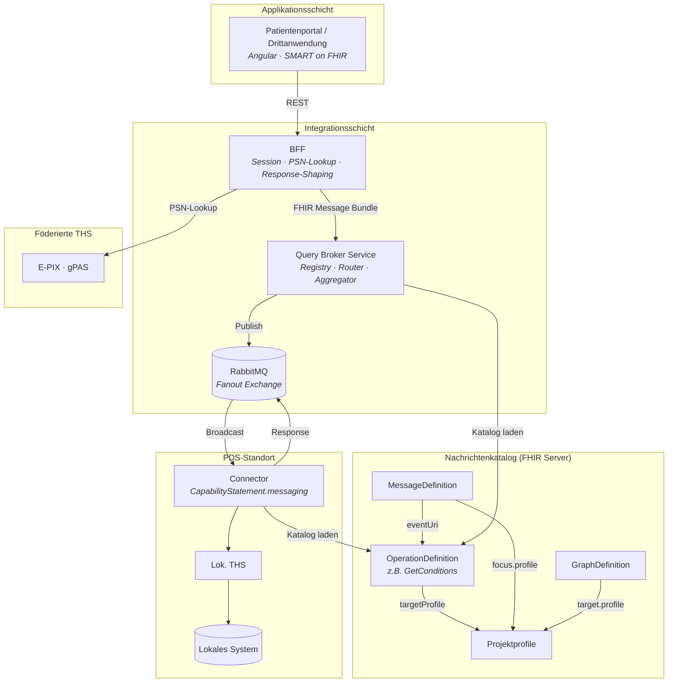

# Query Broker

> Version 0.1.0 · 2026-05-01 · [CHANGELOG](CHANGELOG.md)

**Föderierter Query Broker für die Integration verteilter Primärdatenquellen (PDS, Primary Data Source) über ein Patientenportal und Drittanwendungen.**

---

## Überblick

Der Query Broker verteilt Datenanfragen an mehrere Primärdatenquellen, aggregiert deren Antworten und liefert normalisierte FHIR R4 Bundles zurück — profilkonform zu den im Katalog konfigurierten Profilen. Die Architektur entkoppelt Transport (AMQP/RabbitMQ), Operationssemantik (FHIR OperationDefinition, MessageDefinition, GraphDefinition) und lokale Datenanbindung (Connector-Adapter) voneinander.

### Designprinzipien

- **FHIR Messaging** — Alle Nachrichten sind FHIR R4 Bundles vom Typ `message` (vgl. [FHIR Messaging](https://hl7.org/fhir/R4/messaging.html)).
- **Stabile Transportschicht** — AsyncAPI definiert nur die AMQP-Topologie. Die Nachrichtensemantik lebt in FHIR-Ressourcen.
- **Profilkonformität** — Output-Ressourcen können über `targetProfile` an beliebige FHIR-Profile gebunden werden (z.B. MII KDS, US Core, eigene Projektprofile). Die Validierung im Connector-Stub ist konfigurierbar und greift nur, wenn ein `targetProfile` deklariert ist.
- **Connector als Adapter** — Jeder PDS-Connector übersetzt zwischen Broker-Protokoll und lokalem Datensystem.
- **Föderierte Pseudonymisierung** — MOSAiC / E-PIX / gPAS. Pseudonyme als FHIR `Identifier` in der `Parameters`-Ressource.
- **Broadcast mit Self-Filtering** — Fanout Exchange; Connector filtert nach gPAS-Domäne und Capabilities.
- **Daten-Provenienz und Verarbeitungsprotokoll** — `Provenance` dokumentiert Herkunft pro Ressource (PDS, Quellsystem), `AuditEvent` dokumentiert Verarbeitungsschritte. `Resource.meta.source` als leichtgewichtige Kurzreferenz. Alles FHIR-nativ, als Bundle-Einträge transportiert.

### Architekturüberblick



### Beispieloperation

> Welche Operationen definiert werden und an welche Profile sie gebunden sind, wird im projektspezifischen Nachrichtenkatalog festgelegt. OperationDefinition-Namen folgen dem FHIR-Namensschema: PascalCase, Regex `[A-Z]([A-Za-z0-9_]){1,254}` (FHIR Constraint opd-0). Die Profilbindung (`targetProfile`) ist optional und projektspezifisch wählbar — z.B. MII KDS, US Core, IPS oder eigene Projektprofile. Operationen ohne `targetProfile` liefern FHIR-Basisressourcen zurück.

Beispiel: Eine Operation `GetConditions` ruft Diagnosen eines pseudonymisierten Patienten ab. Über `targetProfile` kann die Ausgabe an ein beliebiges `Condition`-Profil gebunden werden — oder an den FHIR-Basistyp ohne weitere Einschränkung:

---

## Schnellstart

```bash
docker compose up -d                    # RabbitMQ, Katalog-Server, Mock-THS
./gradlew :broker:bootRun               # Broker starten
./gradlew :connectors:pds-example:bootRun  # Referenz-Connector starten
```

---

## Dokumentation

| Dokument                                           | Inhalt                                                                 |
| -------------------------------------------------- | ---------------------------------------------------------------------- |
| **[ARCHITECTURE.md](docs/ARCHITECTURE.md)**        | Arc42-Architekturdokumentation (12 Kapitel)                            |
| **[INTEGRATION.md](INTEGRATION.md)**               | Sprachagnostischer Implementierungsleitfaden für PDS-Entwickler        |
| **[CONTRIBUTING.md](CONTRIBUTING.md)**             | Broker/SDK-Entwicklung, Konformitätstests, neue Operationen definieren |
| **[AsyncAPI Spec](specs/pds-connector-base.yaml)** | Transport-Contract (AMQP-Topologie)                                    |
| **[Nachrichtenkatalog](catalog/)**                 | OperationDefinitions, MessageDefinitions, GraphDefinitions             |

---

## Standards

| Komponente              | Standard                                             | Referenz                                                                 |
| ----------------------- | ---------------------------------------------------- | ------------------------------------------------------------------------ |
| Nachrichtenformat       | FHIR R4 Messaging                                    | [HL7](https://hl7.org/fhir/R4/messaging.html)                            |
| Nachrichtenvertrag      | FHIR MessageDefinition                               | [HL7](https://hl7.org/fhir/R4/messagedefinition.html)                    |
| Operationsspezifikation | FHIR OperationDefinition                             | [HL7](https://hl7.org/fhir/R4/operationdefinition.html)                  |
| Payload-Struktur        | FHIR GraphDefinition                                 | [HL7](https://hl7.org/fhir/R4/graphdefinition.html)                      |
| Capability-Discovery    | FHIR CapabilityStatement.messaging                   | [HL7](https://hl7.org/fhir/R4/capabilitystatement.html)                  |
| Output-Profilierung     | FHIR StructureDefinition (projektspezifisch wählbar) | [HL7](https://hl7.org/fhir/R4/structuredefinition.html)                  |
| Daten-Provenienz        | FHIR Provenance                                      | [HL7](https://hl7.org/fhir/R4/provenance.html)                           |
| Verarbeitungsprotokoll  | FHIR AuditEvent                                      | [HL7](https://hl7.org/fhir/R4/auditevent.html)                           |
| Transport               | AMQP 0-9-1 / AsyncAPI 3.0                            | [AsyncAPI](https://www.asyncapi.com/docs/reference/specification/v3.0.0) |
| Pseudonymisierung       | MOSAiC: E-PIX, gPAS                                  | [THS Greifswald](https://www.ths-greifswald.de/forscher/mosaic-projekt/) |
| Authentifizierung       | SMART on FHIR / OAuth2                               | [SMART](https://docs.smarthealthit.org/)                                 |
| Service-Verzeichnis     | IHE mCSD                                             | [IHE](https://profiles.ihe.net/ITI/mCSD/)                                |

## Lizenz

[TODO: Lizenz festlegen]
