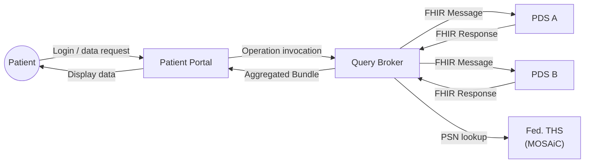
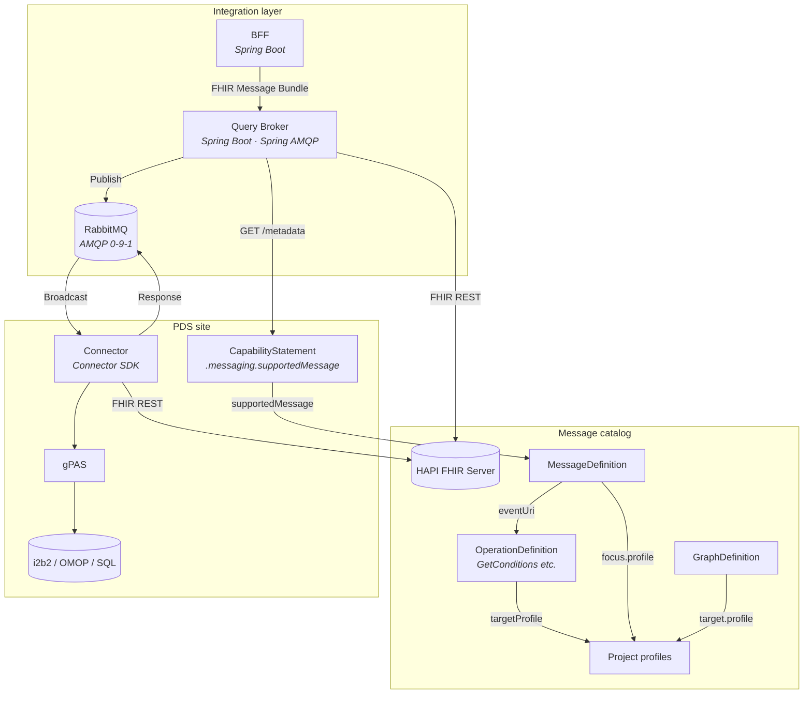
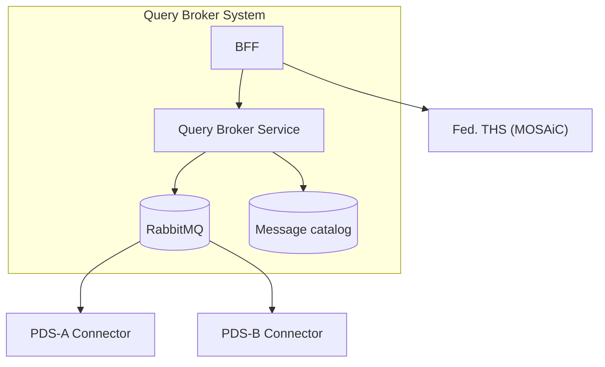
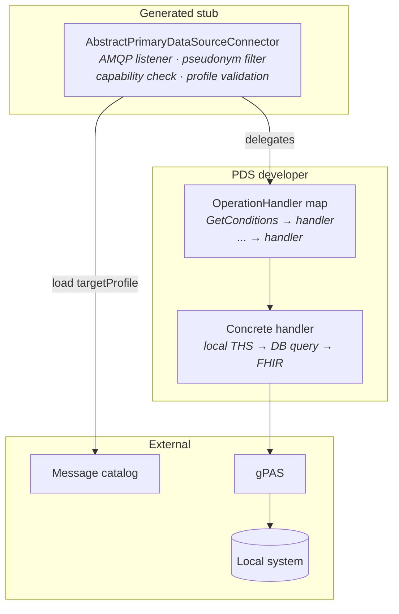
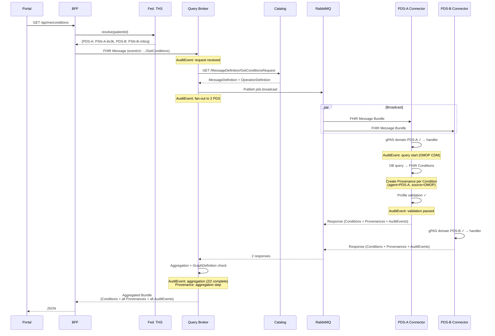
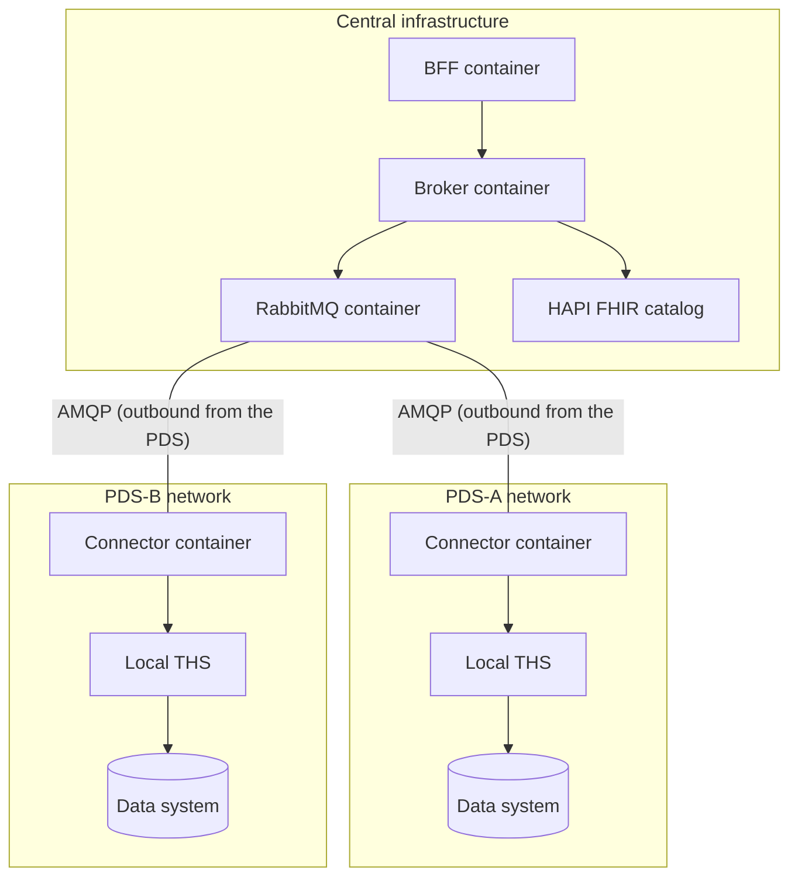
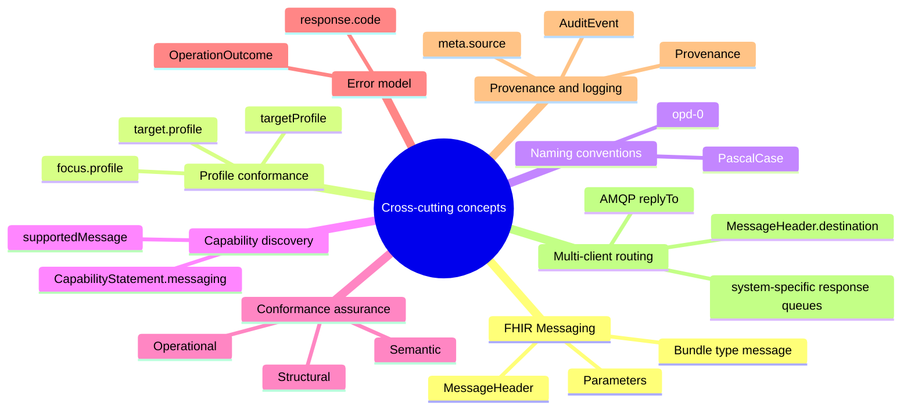
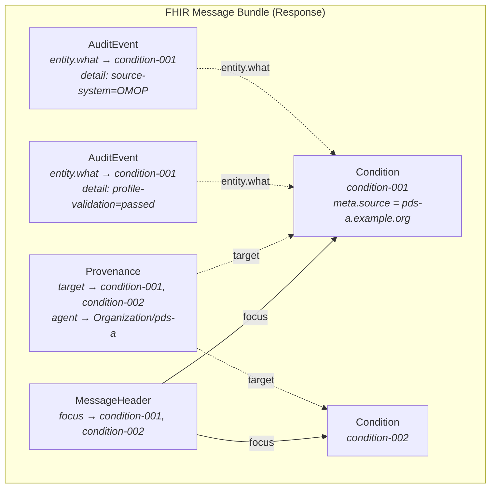

# Architecture Documentation — Query Broker

> Version 0.2.0 · 2026-05-04 · Structured according to the [arc42](https://arc42.org/) template v9.0 (July 2025). Not all sections are filled in at the current project stage.

---

## 1. Introduction and Goals

### 1.1 Requirements Overview

The Query Broker distributes data requests from a patient portal (and potential third-party applications) to multiple primary data sources (PDS), aggregates their responses, and returns normalized, profile-conformant FHIR R4 Bundles.

### 1.2 Quality Goals

| Priority | Quality goal | Scenario |
|-----------|---------------|----------|
| 1 | **Interoperability** | All messages and responses are FHIR R4 conformant; response resources conform to the configured profiles. |
| 2 | **Extensibility** | A new operation can be added by creating FHIR resources in the catalog — without rebuilding existing connectors. |
| 3 | **Decoupling** | A new PDS site is onboarded by deploying a connector and setting up a RabbitMQ queue — without changing the broker. |
| 4 | **Fault tolerance** | The broker delivers partial results with `OperationOutcome` when individual PDS do not respond. |
| 5 | **Traceability** | Every resource in the aggregated Bundle carries its origin (PDS, source system) and a processing log (validation, aggregation). |

### 1.3 Stakeholders

| Role | Expectation |
|-------|-----------|
| PDS developers | Clear connector interface, SDK with generated stub, conformance tests |
| Project core developers | Extensible architecture, standards-based, maintainable |
| Patient portal team | Stable BFF API, FHIR-conformant responses |
| Data protection officers | Pseudonymized data processing, no central data store |

---

## 2. Constraints

### 2.1 Technical Constraints

| Constraint | Explanation |
|---------------|-------------|
| Data in PDS not stored as FHIR | PDS data systems are heterogeneous (i2b2, OMOP CDM, SQL, HL7 v2). Connectors must translate as adapters. |
| Pseudonymization via MOSAiC | Patient identities are resolved via the federated trusted third party (THS) (E-PIX/gPAS). Each PDS has its own gPAS domain. |
| FHIR R4 as the canonical format | All outputs are FHIR R4, optionally profiled according to project-specific StructureDefinitions. |
| Security deprioritized | Data protection/authorization are currently out of scope. |

### 2.2 Organizational Constraints

| Constraint | Explanation |
|---------------|-------------|
| Profile context | Profiles, terminologies, and governance are defined per project. Example: MII core data set in the MII context, US Core in the US context, custom project profiles. |
| Decentralized PDS responsibility | Each PDS site is independently responsible for its connector. |

### 2.3 Conventions

| Convention | Rule |
|------------|-------|
| OperationDefinition names | PascalCase, regex `[A-Z]([A-Za-z0-9_]){1,254}` (FHIR constraint opd-0). Example: `GetConditions`. |
| Canonical URLs | `https://{project}.example.org/fhir/{ResourceType}/{Name}` |
| Profile URLs | Project-specific. Example MII KDS: `https://www.medizininformatik-initiative.de/fhir/core/modul-{name}/StructureDefinition/{Ressource}` |
| Pseudonym identifier | `system` = gPAS domain (`https://ths.example.org/gpas/domain/{PDS-ID}`), `value` = pseudonym |

---

## 3. Context and Scope

### 3.1 Business Context

| External partner | Interface | Format |
|------------------|---------------|--------|
| Patient portal | REST (BFF API) | JSON (FHIR-based) |
| PDS connectors | AMQP (RabbitMQ) | FHIR Message Bundle (`application/fhir+json`) |
| Federated THS | REST (E-PIX API) | E-PIX-specific |
| Message catalog | FHIR REST API | FHIR R4 (OperationDefinition, MessageDefinition, GraphDefinition) |

### 3.2 Technical Context

---

## 4. Solution Strategy

| Decision | Rationale |
|--------------|------------|
| **FHIR Messaging instead of a proprietary envelope** | One format, one parser (HAPI FHIR). According to the FHIR spec, OperationDefinitions can be invoked via messaging ([FHIR R4 Messaging](https://hl7.org/fhir/R4/messaging.html)). |
| **Triple of OperationDefinition + MessageDefinition + GraphDefinition** | An OperationDefinition alone does not describe the complete message contract. MessageDefinition formalizes mandatory payloads and allowed responses. GraphDefinition formalizes the payload graph. |
| **Profile binding via `targetProfile`** | FHIR-native mechanism. Profiles are selectable per project (e.g. MII KDS, US Core, custom profiles). Validation with standard FHIR tooling (HAPI Validator). Operations without `targetProfile` return base FHIR resources. |
| **AsyncAPI for transport only** | Stable AMQP topology. Message semantics live in FHIR resources — new operations require no rebuild. |
| **Adapter pattern for connectors** | PDS systems do not speak FHIR. Structural translation is needed on both sides (inbound and outbound). |
| **Broadcast with self-filtering** | Fanout Exchange minimizes configuration effort. The connector filters by gPAS domain and `CapabilityStatement.messaging`. |
| **CapabilityStatement.messaging instead of proprietary discovery** | FHIR-native mechanism for capability declaration ([FHIR R4 CapabilityStatement](https://hl7.org/fhir/R4/capabilitystatement.html)). |
| **Provenance + AuditEvent for origin and processing log** | `Provenance` documents data origin per resource (PDS, source system, transformation). `AuditEvent` documents processing steps (query, validation, aggregation). Both are FHIR R4 resources and are transported as Bundle entries — no proprietary logging ([FHIR R4 Provenance](https://hl7.org/fhir/R4/provenance.html), [FHIR R4 AuditEvent](https://hl7.org/fhir/R4/auditevent.html)). |

---

## 5. Building Block View

### 5.1 Level 1 — Overall System Decomposition

| Building block | Responsibility | Interfaces | Technology |
|----------|-------------------|----------------|-------------|
| **BFF** | Session, PSN lookup, response shaping | REST ← portal, REST → broker, REST → THS | Spring Boot, HAPI FHIR |
| **Query Broker Service** | Validation (MessageDefinition), routing (CapabilityStatement), fan-out, aggregation, profile validation. Creates `AuditEvent` resources for request receipt, fan-out, aggregation, and response dispatch. Creates `Provenance` for the aggregation step. | AMQP → RabbitMQ, FHIR REST → catalog, REST → connector `/metadata` | Spring Boot, Spring AMQP, HAPI FHIR |
| **RabbitMQ** | Message transport (fanout/topic), queue isolation, DLQ | AMQP 0-9-1 | RabbitMQ 3.12+, AsyncAPI 3.0 |
| **Message catalog** | OperationDefinition, MessageDefinition, GraphDefinition, project-specific profiles | FHIR REST API | HAPI FHIR Server, FHIR profile packages |
| **PDS Connector** | Self-filtering, capability check, dispatch, adapter, profile validation before dispatch. Creates `Provenance` per business resource (origin: PDS, source system) and `AuditEvent` for query execution and validation result. | AMQP ← RabbitMQ, REST `/metadata`, REST → local THS | Connector SDK (generated from AsyncAPI), Spring Boot, HAPI FHIR |
| **Fed. THS** | Pseudonym resolution across PDS boundaries | REST API (E-PIX) | MOSAiC E-PIX, gPAS |

### 5.2 Level 2 — Message Catalog (Whitebox)

| Building block | Responsibility | FHIR reference |
|----------|-------------------|---------------|
| **OperationDefinition** | Semantics: parameters, types, cardinalities, `targetProfile` → project profile (optional) | [HL7 FHIR R4](https://hl7.org/fhir/R4/operationdefinition.html) |
| **MessageDefinition (Request)** | Message contract: `focus` (mandatory payloads), `allowedResponse` | [HL7 FHIR R4](https://hl7.org/fhir/R4/messagedefinition.html) |
| **MessageDefinition (Response)** | Response contract: `focus.profile` → project profile (optional) | [HL7 FHIR R4](https://hl7.org/fhir/R4/messagedefinition.html) |
| **GraphDefinition** | Payload structure: resource graph, `target.profile` → project profile (optional) | [HL7 FHIR R4](https://hl7.org/fhir/R4/graphdefinition.html) |
| **Project profiles** | FHIR StructureDefinitions for output resources (e.g. MII KDS, US Core, custom profiles) | [Project-specific] |

### 5.3 Level 2 — PDS Connector (Whitebox)

| Building block | Responsibility | Technology |
|----------|-------------------|-------------|
| **AbstractPrimaryDataSourceConnector** | FHIR message parsing, gPAS domain filtering, capability check, `targetProfile` validation, `Provenance` creation per resource, `AuditEvent` creation for query and validation | Connector SDK (generated), HAPI FHIR Validator |
| **OperationHandler** | Interface: `Bundle execute(String pseudonym, Parameters params)` | `@FunctionalInterface` |
| **Concrete handler** | Adapter: local system → FHIR (profile-conformant if `targetProfile` is declared). Sets `Resource.meta.source` to the connector URL. | Provided by the PDS developer, HAPI FHIR |

---

## 6. Runtime View

### 6.1 Scenario: Retrieve Diagnoses (`$GetConditions`)

### 6.2 Scenario: PDS Does Not Support an Operation

The connector responds with `MessageHeader.response.code = fatal-error` and an `OperationOutcome` resource (`issue.code = not-supported`). The aggregator counts this response as complete but excludes it from the result Bundle.

---

## 7. Deployment View

> PDS connectors establish **outbound** AMQP connections to the central RabbitMQ — no inbound connections into PDS networks are needed. This considerably simplifies firewall configuration in hospital networks.

---

## 8. Cross-cutting Concepts

> The following concepts span multiple building blocks and layers.

### 8.1 FHIR Messaging as the Message Format

All messages are FHIR R4 Bundles of type `message`. `MessageHeader.eventUri` references the canonical OperationDefinition URL. Parameters and pseudonyms are transmitted as typed entries in a `Parameters` resource. Pseudonyms use the FHIR data type `Identifier` with `system` = gPAS domain (cf. [FHIR R4 Messaging](https://hl7.org/fhir/R4/messaging.html)).

### 8.2 Profile Conformance

Profile binding is optional and project-specific. If a `targetProfile` is declared in the OperationDefinition, it is enforced in three places:

| Location | FHIR element | Effect |
|--------|-------------|---------|
| OperationDefinition | `return.part[].targetProfile` | Declares which profile output resources must conform to |
| MessageDefinition (Response) | `focus[].profile` | Declares the profile for resources in the response message |
| GraphDefinition | `link[].target[].profile` | Declares profiles for linked resources in the response graph |

Validation takes place in the generated connector stub before dispatch (HAPI FHIR Validator + profile packages as a dependency) and optionally in the broker on receipt. Operations without `targetProfile` skip validation — the handler returns base FHIR resources.

> The profiles themselves are configurable per project: MII KDS in the MII context, US Core for US projects, IPS for international scenarios, or custom project profiles. They are installed in the catalog server as FHIR packages (NPM format) and included in the Connector SDK as a dependency.

### 8.3 OperationDefinition Naming Convention

OperationDefinition names follow the FHIR naming scheme (constraint opd-0, regex `[A-Z]([A-Za-z0-9_]){1,254}`). The convention is PascalCase without underscores, analogous to the OperationDefinitions of the FHIR core specification (cf. [FHIR R4 OperationDefinition](https://hl7.org/fhir/R4/operationdefinition.html)).

| Examples (correct) | Examples (incorrect) |
|---------------------|--------------------|
| `GetConditions` | ~~`GET_CONDITIONS`~~ |
| `FetchSomething` | ~~`fetch-something`~~ |
| `RetrieveData` | ~~`retrieveData`~~ (starts with a lowercase letter) |

### 8.4 Capability Discovery

Each connector publishes a `CapabilityStatement` at `GET /metadata` with `messaging.supportedMessage` entries pointing to MessageDefinition URLs. The broker queries these at startup and builds its routing directory dynamically (cf. [FHIR R4 CapabilityStatement](https://hl7.org/fhir/R4/capabilitystatement.html)).

### 8.5 Conformance Assurance

Three dimensions: structural (profile validation), semantic (test data + CodeSystem checks), operational (mock-broker integration tests). Details in [CONTRIBUTING.md](../CONTRIBUTING.md#3-run-conformance-tests).

### 8.6 Error Model

Errors are transmitted as FHIR `OperationOutcome`. `MessageHeader.response.code` signals `ok`, `transient-error`, or `fatal-error` (cf. [FHIR R4 OperationOutcome](https://hl7.org/fhir/R4/operationoutcome.html)).

### 8.7 Data Provenance and Processing Log

Two FHIR resources cover proof of origin and logging — without proprietary mechanisms:

**`Provenance`** documents where a business resource comes from (cf. [FHIR R4 Provenance](https://hl7.org/fhir/R4/provenance.html)):

| Element | Usage |
|---------|-----------|
| `target[]` | References to the business resources (Conditions, Observations, etc.) |
| `agent[].who` | `Reference(Organization)` — the PDS as the originating organization |
| `agent[].type` | `performer` (PDS), `assembler` (connector software) |
| `entity[].role` | `source` — the local source system |
| `entity[].what.identifier` | System URL and record ID in the source system (e.g. OMOP `condition_occurrence/48291`) |
| `activity` | Coding from `v3-DataOperation` (`CREATE`, `UPDATE`) |

**`AuditEvent`** documents that a processing step took place (cf. [FHIR R4 AuditEvent](https://hl7.org/fhir/R4/auditevent.html)):

| Element | Usage |
|---------|-----------|
| `action` | `E` (Execute) |
| `period` | Start/end of the processing step |
| `outcome` | `0` (success), `4` (minor failure), `8` (serious failure) |
| `agent[].who` | `Reference(Device)` — connector or broker as the processing instance |
| `entity[].detail[]` | Key-value pairs: `operation`, `pseudonym-domain`, `source-system`, `profile-validation`, `result-count`, `duration-ms` |

**Distribution of responsibilities:**

| Component | Creates | Content |
|------------|---------|--------|
| **PDS Connector** | `Provenance` (per business resource) | PDS organization, source system, connector version, transformation type |
| **PDS Connector** | `AuditEvent` (per processing step) | Query execution (duration, source system), profile validation result |
| **Query Broker** | `AuditEvent` (per broker action) | Request receipt, fan-out (number of PDS), aggregation (complete/partial, timeouts) |
| **Query Broker** | `Provenance` (aggregation step) | Which PDS responses were merged, deduplication |

**Lightweight alternative:** In addition to the full `Provenance`, each connector sets `Resource.meta.source` to the connector URL. This allows a quick look at which resource came from which PDS in the aggregated Bundle — without having to traverse the provenance chain.

**Transport in the Bundle:** Provenance and AuditEvent are transported as regular entries in the FHIR Message Bundle. `MessageHeader.focus` continues to reference only the business resources. Provenance and AuditEvent are linked to the business resources via `Provenance.target` and `AuditEvent.entity.what`:

---

### 8.8 Multi-Client Routing

Multiple requesting systems (portal, CDSS, research portal) can submit requests through the broker concurrently. Routing the aggregated response to the correct system is done via `MessageHeader.destination` (FHIR level) and AMQP `replyTo` (transport level):

| Level | Mechanism | Responsibility |
|-------|-------------|---------------|
| FHIR | `MessageHeader.destination.endpoint` in the request → response queue URI | Requesting system sets it, broker evaluates it |
| AMQP | `replyTo` header in the request → response queue name | BFF/client sets it, broker publishes to it |
| Fallback | Requests without `destination` → `responses.default` | Broker uses the default queue |

Each requesting system gets its own response queue (e.g. `responses.portal`, `responses.cdss`). The ResponseAggregator correlates the connector responses via `MessageHeader.response.identifier` and publishes the aggregated Bundle to the queue from `destination.endpoint`.

---

## 9. Architecture Decisions

### ADR-001: Adapter Pattern Instead of Proxy for Connectors

**Context:** PDS data systems do not speak the same interface as the broker.
**Decision:** Adapter pattern — structural translation on both sides.
**Rationale:** A proxy presupposes an identical interface. PDS with heterogeneous systems require translation.

### ADR-002: FHIR Message Bundles Instead of a Proprietary JSON Envelope

**Context:** Messages between broker and connectors need a defined format.
**Decision:** FHIR Message Bundles with MessageHeader, Parameters, OperationOutcome.
**Rationale:** One format, one parser. The FHIR spec permits operation invocation via messaging.

### ADR-003: Triple of OperationDefinition + MessageDefinition + GraphDefinition

**Context:** An OperationDefinition alone does not describe the complete message contract.
**Decision:** MessageDefinition for mandatory payloads + allowed responses. GraphDefinition for payload structure.
**Rationale:** Validatable contracts instead of implicit convention.

### ADR-004: CapabilityStatement.messaging Instead of Proprietary Discovery

**Context:** Connectors must declare which operations they support.
**Decision:** `CapabilityStatement.messaging.supportedMessage`.
**Rationale:** FHIR-native, standardized, queryable.

### ADR-005: Pseudonyms as Parameters Identifiers (Not a MessageHeader Extension)

**Context:** Pseudonyms must be transmitted in the request.
**Decision:** `parameter` of type `Identifier`, `system` = gPAS domain.
**Rationale:** Pseudonyms are operation parameters, not control information.

### ADR-006: Fanout Exchange to Start, Topic as the Target Architecture

**Context:** Simple start vs. precise routing.
**Decision:** Fanout for the prototype, Topic with `pds.{pdsId}.*` as the system grows.
**Revision (2026-07, topic-exchange increment):** the topic routing is now implemented and the default. The broker derives the addressed sites from the pseudonym gPAS domains (`primaryDataSourceIdOf` = last path segment of the domain) and publishes each request only to those sites on the topic exchange `pds.topic` with routing key `pds.{pdsId}.request`; a connector binds its queue with `pds.{pdsId}.request` and receives only requests addressed to it. **Unaddressed sites receive nothing** — a confidentiality improvement over the fanout broadcast (pinned by an integration test). The migration is additive: connectors DUAL-bind their queue (fanout `pds.broadcast` AND topic `pds.topic`), self-filtering by gPAS domain remains as a safety net, and `broker.routing-mode` (`topic` default | `fanout`) selects the topology so either works during rollout. The AsyncAPI spec (`pds.topic` channel) and `docker/rabbitmq/definitions.json` were updated in lockstep. Not yet done (future refinement): per-site pseudonym filtering — today each addressed site still receives the full request bundle (all pseudonyms) and self-filters; sending each site only its own pseudonym would tighten confidentiality further.

### ADR-007: PascalCase Names for OperationDefinitions

**Context:** FHIR constraint opd-0 requires `[A-Z]([A-Za-z0-9_]){1,254}`.
**Decision:** PascalCase without underscores (e.g. `GetConditions`), analogous to the FHIR core specification.
**Rationale:** Consistency with HL7 practice. Underscores are valid but uncommon.

### ADR-008: Provenance + AuditEvent Instead of Proprietary Logging

**Context:** Data origin and the processing log must be traceable in the aggregated Bundle.
**Decision:** `Provenance` for data origin per resource (created by the connector), `AuditEvent` for processing steps (created by connector + broker). `Resource.meta.source` as a lightweight short reference. Everything transported as regular Bundle entries.
**Rationale:** FHIR-native resources, no proprietary log format. Provenance and AuditEvent are standardized FHIR R4 resources with defined semantics ([FHIR R4 Provenance](https://hl7.org/fhir/R4/provenance.html), [FHIR R4 AuditEvent](https://hl7.org/fhir/R4/auditevent.html)). The path of every resource from source to display is reconstructible.

### ADR-009: MessageHeader.destination for Multi-Client Routing

**Context:** Multiple requesting systems (portal, CDSS, research portal) can submit requests through the broker concurrently. Without a discriminator at the message and routing level, the broker cannot assign the aggregated response to the correct requesting system.
**Decision:** `MessageHeader.destination.endpoint` is set in the request by the requesting system to a system-specific response queue (e.g. `amqp://.../responses.portal`). The broker reads this value and publishes the aggregated Bundle to the corresponding queue. At the AMQP level, `replyTo` correlates in parallel with `destination.endpoint`. For requests without `destination`, a default response queue is used (`responses.default`).
**Rationale:** FHIR `MessageHeader.destination` is the standardized mechanism for message routing ([FHIR R4 MessageHeader.destination](https://hl7.org/fhir/R4/messageheader-definitions.html#MessageHeader.destination)). The combination with AMQP `replyTo` ensures consistency at both levels (FHIR semantics + transport).

### ADR-010: Implementation as Gradle Multi-Module Monorepo (Java 21 / Spring Boot 3 / HAPI FHIR 8)

**Context:** The repository is specification-first; the broker, connector SDK, and reference connector must now be implemented. The specification artifacts (IG, AsyncAPI, catalog) and the code that realizes them evolve in lockstep — an operation change touches the triple, the handler contract, and the conformance tests together. The first consumer is the MiHUB patient portal, whose backend toolchain is Java 21 + HAPI FHIR 8.
**Decision:** The implementation lives in this repository as a Gradle multi-module build (`broker/`, `connector-sdk/`, `connectors/pds-example/`, `conformance/`) on Java 21 (LTS), Spring Boot 3.x with Spring AMQP, and HAPI FHIR 8.x; tests use JUnit 5 + AssertJ + Testcontainers. All modules share the repository version (`version.txt`, managed by release-please); broker and reference connector are released as container images, and the connector SDK is published to a Maven registry only once an external PDS consumer exists. The BFF is a patient-portal component and is implemented in the portal repository — this repository stays consumer-agnostic.
**Rationale:** Co-locating contract and implementation makes spec/code drift impossible to merge unnoticed (one PR changes triple + code + conformance test) and keeps the conformance harness next to the artifacts it enforces. A single org-wide stack (matching the portal) minimizes cognitive and operational overhead; a single repo version keeps release automation trivial until independent SDK versioning is actually demanded by external consumers.

### ADR-011: Staged Pilot Implementation — Walking Skeleton First

**Context:** The architecture describes registry, router, aggregator, profile validation, provenance/audit, THS integration, and multi-client routing. Implementing all of it before anything runs end-to-end would defer integration risk (correlation, timeouts, routing) to the end. The pilot consumer is the patient portal; data-protection constraints (DPIA, no real THS access) gate several capabilities.
**Decision:** Implementation proceeds in staged increments. **Increment 1, work package 0 (communication profiles):** before any code, the IG's communication-profile layer is completed — Bundle profiles for the request/response message envelopes (`BrokerRequestBundle`, `BrokerResponseBundle`), a `BrokerOperationOutcome` profile with a broker error CodeSystem/ValueSet pinning the § 8.6 error model, and the hitherto dangling `OperationError` MessageDefinition — compiled at 0/0 and mirrored into `catalog/`; skeleton tests assert conformance against these profiles. **Increment 1 (walking skeleton):** one vertical slice of `$GetConditions` over the existing fanout topology — broker (catalog load, publish, correlation, timeout → `OperationOutcome`) and reference connector (synthetic in-memory data, static pseudonym map behind a `TrustedThirdPartyClient` port); done when `docker compose up` runs the full loop and an integration test proves it; no validation, no BFF, no real THS. **Increment 2:** conformance harness as a Gradle module (catalog-driven golden tests, CI gate), SDK runtime validation active only when a `targetProfile` is configured, two synthetic connector instances with distinct PDS IDs/pseudonym domains/datasets (proving fan-out, self-filtering, aggregation, partial responses, per-PDS provenance), and MOSAiC gPAS/E-PIX dev containers replacing the static map. **Increments 2–3:** migration from fanout to the `pds.{pdsId}.*` topic exchange as a named increment with its own revision of ADR-006 (additive, dual binding during migration). **Portal integration:** BFF read-through with ephemeral responses — no portal-side persistence; any cache/import layer requires its own ADR and DPIA assessment. **Security staging:** compose-internal for the skeleton; for the pilot, the BFF (portal Keycloak JWT) is the sole entry point, RabbitMQ uses dedicated per-service users/vhost with TLS at deployment, messages carry pseudonyms only, and user context stays in BFF audit events; end-to-end token propagation is deferred to a future security ADR. **Out of pilot scope:** SMART third-party app access, IHE mCSD service directory, any real hospital PDS site (program-level, governance-gated).
**Rationale:** A thin end-to-end slice validates the riskiest, most novel mechanics (correlation, aggregation, timeout semantics) earliest and cheapest; every later capability lands on a proven transport. Staging THS, validation, and security keeps the DPIA surface minimal during development while preserving the documented target architecture — each deferred capability has a defined landing slot instead of being silently dropped. Full details per increment: [IMPLEMENTATION_PLAN.md](IMPLEMENTATION_PLAN.md).

### ADR-012: Content-Profile Strategy — MII KDS First, IPA-Aligned Facade Boundary

**Context:** Profile binding in this architecture is deliberately project-specific (ADR-003, § 8.2), and the pilot now needs concrete bindings. A dedicated research pass over European and international patient-access FHIR IGs ([research report 2026-07-16](reports/patient-access-ig-research-2026-07-16.md), all findings source-verified) established: (1) the data integration centers (DICs — this project's primary-data-source sites) natively hold **MII Kerndatensatz (KDS)**-shaped data, and no MII patient-access IG exists; (2) **HL7 International Patient Access (IPA) 1.1.0** is the universal patient-access baseline, and the EHDS-track **EU Health Data API** (1.0.0-ballot, candidate spec for the EHDS Art. 15/Annex II Implementing Acts) hard-depends on it; (3) **no published patient-access IG uses FHIR messaging** — all prescribe synchronous REST with OAuth2/SMART-family authorization; the closest precedent to this architecture is IHE MHD acting as a synchronous facade over federated XDS/XCA; (4) the EU Health Data API models patient access as a trusted "Health Data Access Service" (system-to-system after eID login, SMART App Launch out of scope) — matching this project's BFF pattern.
**Decision:** A two-layer content-profile strategy. **Layer 1 (DIC-facing, now):** MII KDS module profiles are the `targetProfile`/`focus.profile`/`target.profile` bindings of the operation catalog, starting with `GetConditions` → MII KDS Diagnose (Condition); KDS packages become IG dependencies and are made available to the SDK/harness validators via FHIR package loading. **Layer 2 (portal-facing, staged):** IPA 1.1.0 is the minimum content bar — broker responses are additionally validated against IPA profiles in the conformance harness as the operation set grows, and the future BFF (portal repository) is built as the IPA-shaped synchronous facade; IPA/EU-HDAA REST conformance is claimed only at that facade, never by the broker. The EU Health Data API and HL7 EU Patient Summary ballots go on a watch list; this ADR is re-evaluated when the EU Health Data API reaches its first non-ballot release.
**Rationale:** Mapping cost is lowest at the connector when the wire profiles match what DICs already hold (KDS); IPA's deliberately minimal "minimum expectations" philosophy makes dual KDS+IPA validation cheap; anchoring the facade on IPA keeps the system on the EHDS convergence path (the EU Health Data API composes IPA + MHD) without betting on a ballot-stage spec; and the facade-over-federation split has standards precedent (MHD-over-XDS), giving the messaging backbone a defensible conformance story: *IPA-aligned content over a federated messaging backbone, with the portal-facing facade as the conformance boundary.*

### ADR-013: Generic Remote Terminology-Server Integration — SU-TermServ for the Pilot

**Context:** ADR-012 deliberately parked terminology/binding validation: the national code systems bound by the MII KDS profiles (ICD-10-GM, ATC, …) live in terminology packages too large to vendor, and the pilot had no terminology server. The MII operates a central terminology service — the SU-TermServ (an Ontoserver-based service; access requires an approved application and an mTLS client certificate) — which hosts exactly those national terminologies. The integration must be generic so other FHIR terminology servers (e.g. a project-run CSIRO Ontoserver) are configuration, not code.
**Decision:** Terminology validation is delegated to a remote FHIR terminology server via HAPI's `RemoteTerminologyServiceValidationSupport` (standard `$validate-code`/`$expand`/`$lookup` operations — server-agnostic by construction), configured through a single `TerminologyServerConfig` (FHIR base URL + optional PKCS12 client keystore/truststore for mutual TLS). The remote support is placed BEFORE the in-memory expander so server answers are not shadowed by local expansion failures. Activation is strictly opt-in: connector configuration (`pds.connector.terminology.*`) or environment variables (`TERMINOLOGY_SERVER_URL` + mTLS variables) for the conformance harness; with no server configured, the ADR-012 structural-only behavior stands unchanged. Certificates and keys are never committed — they are deployment-supplied (the SU-TermServ onboarding artifacts). Implementation note: HAPI's `GenericClient` resolves its HTTP client per request via `FhirContext.getRestfulClientFactory()`, so the mTLS-capable client factory is installed on a dedicated client `FhirContext` (empirically verified; a factory merely passed to the support constructor is bypassed).
**Rationale:** The standard FHIR terminology operations make the integration server-neutral — SU-TermServ vs. Ontoserver vs. any other conformant server is a URL and a certificate. The SU-TermServ is the natural pilot choice because it authoritatively hosts the German national terminologies the KDS bindings require. mTLS is proven by tests against a client-auth-enforcing mock (key material generated at test time, nothing committed); real-server connectivity follows once the application is approved and the certificate issued.

---

## 10. Quality Requirements

> Section 10 follows the arc42 v9.0 structure: 10.1 gives an overview of the quality requirements by category (aligned with [Q42](https://quality.arc42.org/) / ISO 25010:2023); 10.2 makes them concrete through measurable quality scenarios.

### 10.1 Overview

| Category | Quality requirement | Priority | Reference |
|-----------|---------------------|-----------|---------|
| **#interoperable** | All messages and response resources are FHIR R4 conformant and — where configured — conform to the profiles stored in the catalog. | High | → ADR-002, ADR-003 |
| **#flexible** | New operations can be added by creating FHIR resources in the catalog — without rebuilding existing connectors. | High | → ADR-003, Section 8.2 |
| **#flexible** | A new PDS site is onboarded by deploying a connector and setting up a RabbitMQ queue — without changing the broker. | High | → ADR-006, Section 7 |
| **#reliable** | The broker delivers partial results with `OperationOutcome` when individual PDS do not respond. | Medium | → Section 6.2 |
| **#operable** | PDS developers receive a generated connector stub and a conformance test framework. | Medium | → Section 8.5, CONTRIBUTING.md |
| **#secure** | Data remains pseudonymized; no central data store. Authorization scopes for third-party applications are yet to be defined. | Low (currently) | → Section 11 |
| **#traceable** | Every resource in the aggregated Bundle carries its origin (PDS, source system) and a processing log. | High | → ADR-008, Section 8.7 |

### 10.2 Details (Quality Scenarios)

| ID | Stimulus | Response | Metric / acceptance criterion |
|----|----------|----------|---------------------------|
| QS-1 | A connector delivers Condition resources without an ICD-10-GM coding. | The `FhirProfileValidator` in the stub detects the profile violation and sends an `OperationOutcome` instead of invalid data. | 0 non-profile-conformant resources reach the broker. |
| QS-2 | A new PDS is to be onboarded. | The PDS developer generates the stub, implements handlers, declares the queue. | Broker code and existing connectors remain unchanged (0 changes). |
| QS-3 | A PDS does not respond within the configured timeout (default: 8s). | The aggregator produces a partial result with an `OperationOutcome` for the missing PDS. | The portal receives results from the responding PDS within 10s. |
| QS-4 | A new operation `GetNewData` is needed. | The project core creates OperationDefinition + MessageDefinition + GraphDefinition in the catalog. | 0 connector rebuilds required. Existing connectors respond with `not-supported`. |
| QS-5 | A configured profile is published in a new version. | Catalog update (update `targetProfile`), conformance tests per PDS, re-certification. | All connectors validate against the new profile version before the next release. |
| QS-6 | An auditor wants to trace which PDS delivered a specific Condition resource and whether profile validation passed. | `Provenance.agent.who` identifies the PDS, `Provenance.entity.what` the source system. `AuditEvent.entity.detail[profile-validation]` documents the validation result. | Every business resource in the aggregated Bundle has exactly one associated `Provenance` and at least one `AuditEvent`. |

---

## 11. Risks and Technical Debt

| Risk | Impact | Mitigation |
|--------|------------|----------|
| The configured profiles change | Handler output becomes invalid | Pin profile versions in the catalog, re-certification on update |
| AsyncAPI `allOf` tooling gaps | Stub generation fragile when the spec is extended | Keep the AsyncAPI spec minimal (transport only), semantics in FHIR |
| No authorization implemented | Third-party applications could access arbitrary data | Define SMART on FHIR scopes before production use |
| Fanout scaling | With 50+ PDS: every connector receives every message | Migrate to a Topic Exchange with `pds.{pdsId}.*` |

---

## 12. Glossary

| Term | Definition |
|---------|------------|
| **BFF** | Backend for Frontend — dedicated service layer between the portal UI and the broker |
| **Connector** | Standalone microservice per PDS site; adapter between the broker protocol and the local data system |
| **PDS** | Primary data source (German: Primärdatenquelle) — stores primary medical data (e.g. data integration center, hospital IT, laboratory information system) |
| **E-PIX** | Enterprise Patient Identifier Cross-referencing — MOSAiC component for ID management |
| **gPAS** | generic Pseudonym Administration Service — MOSAiC component for pseudonym administration |
| **gICS** | generic Informed Consent Service — MOSAiC component for consent management |
| **GraphDefinition** | FHIR resource; describes the resource graph of a response message with profile binding |
| **MessageDefinition** | FHIR resource; formalizes the message contract (mandatory payloads, allowed responses) |
| **MII** | Medical Informatics Initiative (Medizininformatik-Initiative) — an application context for which MII KDS profiles can be configured as `targetProfile` |
| **MII KDS** | MII core data set (MII-Kerndatensatz) — an example of project-specific FHIR profiles; not inherent to the architecture |
| **MOSAiC** | Modular Open Source Architecture for Identity and Consent — trusted-third-party software from the University of Greifswald |
| **Message catalog** | FHIR server holding OperationDefinitions, MessageDefinitions, GraphDefinitions, and project-specific profiles |
| **OperationDefinition** | FHIR resource; describes the semantics of an operation (parameters, types, `targetProfile`) |
| **OperationOutcome** | FHIR resource for a standardized error model |
| **Partial result** | Aggregated result when individual PDS time out; contains `OperationOutcome` |
| **Provenance** | FHIR resource; documents the origin of a resource — who (agent), when, from which source (entity) |
| **AuditEvent** | FHIR resource; documents a processing step — action, period, outcome, systems involved |
| **Self-filtering** | The connector decides autonomously whether it processes a broadcast message |
| **THS** | Trusted third party (German: Treuhandstelle) — mediates between pseudonyms and identities |
