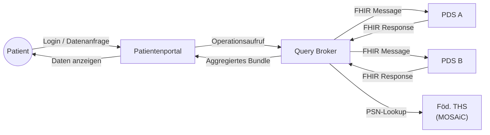
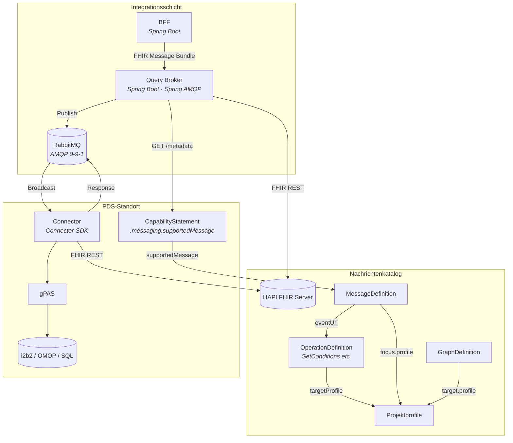
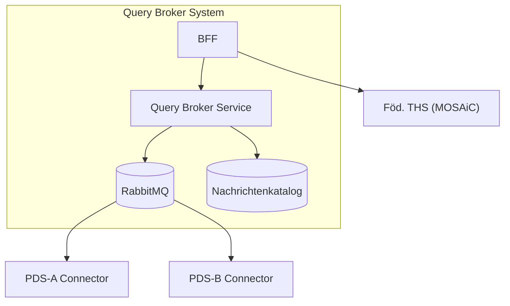
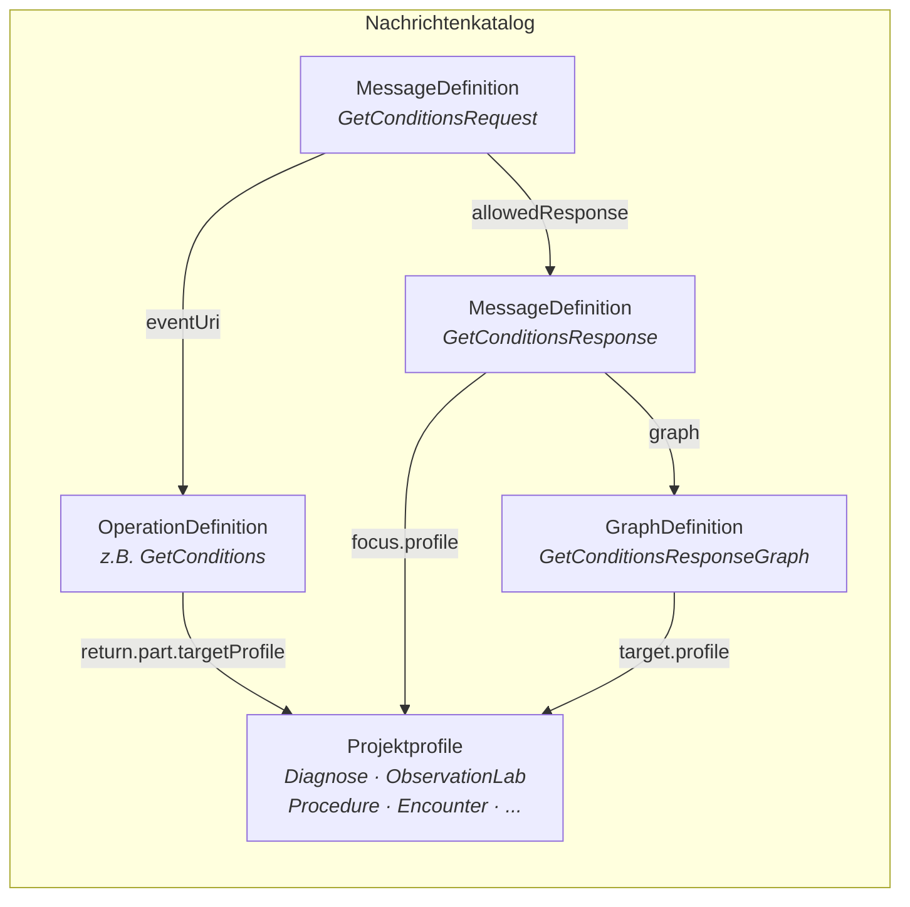
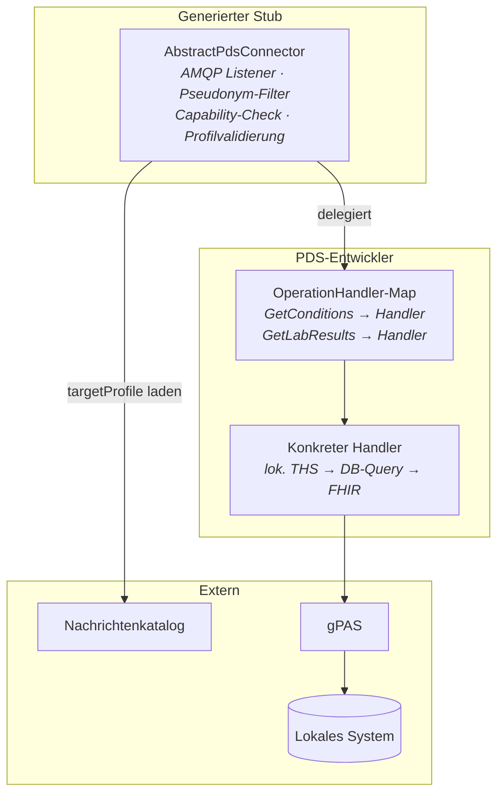
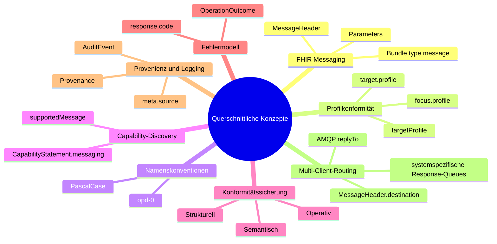
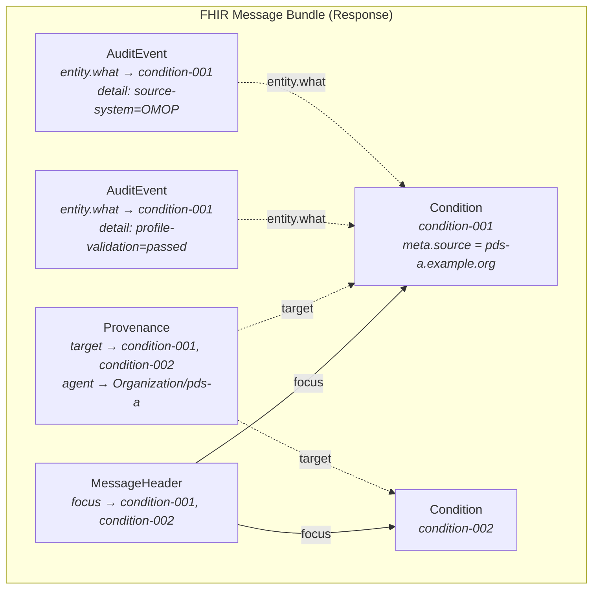

# Architekturdokumentation — Query Broker

> Version 0.1.0 · 2026-05-01 · Struktur nach [arc42](https://arc42.org/) Template v9.0 (Juli 2025). Nicht alle Abschnitte sind in der aktuellen Projektphase befüllt.

---

## 1. Einführung und Ziele

### 1.1 Aufgabenstellung

Der Query Broker verteilt Datenanfragen eines Patientenportals (und potenzieller Drittanwendungen) an mehrere Primärdatenquellen (PDS, Primary Data Source), aggregiert deren Antworten und liefert normalisierte, profilkonforme FHIR R4 Bundles zurück.

### 1.2 Qualitätsziele

| Priorität | Qualitätsziel | Szenario |
|-----------|---------------|----------|
| 1 | **Interoperabilität** | Alle Nachrichten und Antworten sind FHIR R4 konform; Antwort-Ressourcen entsprechen den konfigurierten Profilen. |
| 2 | **Erweiterbarkeit** | Eine neue Operation kann durch Anlegen von FHIR-Ressourcen im Katalog hinzugefügt werden — ohne Rebuild bestehender Connectoren. |
| 3 | **Entkopplung** | Ein neuer PDS-Standort wird durch Deployment eines Connectors und Einrichten einer RabbitMQ-Queue angebunden — ohne Änderung am Broker. |
| 4 | **Ausfalltoleranz** | Der Broker liefert Partial Results mit `OperationOutcome`, wenn einzelne PDS nicht antworten. |
| 5 | **Nachvollziehbarkeit** | Jede Ressource im aggregierten Bundle trägt ihre Herkunft (PDS, Quellsystem) und ein Verarbeitungsprotokoll (Validierung, Aggregation). |

### 1.3 Stakeholder

| Rolle | Erwartung |
|-------|-----------|
| PDS-Entwickler | Klare Connector-Schnittstelle, SDK mit generiertem Stub, Konformitätstests |
| Projektkern-Entwickler | Erweiterbare Architektur, standardbasiert, wartbar |
| Patientenportal-Team | Stabile BFF-API, FHIR-konforme Antworten |
| Datenschutzbeauftragte | Pseudonymisierte Datenverarbeitung, kein zentraler Datenspeicher |

---

## 2. Randbedingungen

### 2.1 Technische Randbedingungen

| Randbedingung | Erläuterung |
|---------------|-------------|
| Daten in PDS nicht als FHIR | PDS-Datensysteme sind heterogen (i2b2, OMOP CDM, SQL, HL7 v2). Connectoren müssen als Adapter übersetzen. |
| Pseudonymisierung via MOSAiC | Patientenidentitäten werden über föderierte THS (E-PIX/gPAS) aufgelöst. Jedes PDS hat eigene gPAS-Domäne. |
| FHIR R4 als kanonisches Format | Alle Ausgaben sind FHIR R4, optional profiliert nach projektspezifischen StructureDefinitions. |
| Sicherheit nachrangig | Datenschutz/Autorisierung sind aktuell nicht im Scope. |

### 2.2 Organisatorische Randbedingungen

| Randbedingung | Erläuterung |
|---------------|-------------|
| Profilkontext | Profile, Terminologien und Governance werden projektspezifisch festgelegt. Beispiel: MII-Kerndatensatz im MII-Kontext, US Core im US-Kontext, eigene Projektprofile. |
| Dezentrale PDS-Verantwortung | Jeder PDS-Standort verantwortet seinen Connector eigenständig. |

### 2.3 Konventionen

| Konvention | Regel |
|------------|-------|
| OperationDefinition-Namen | PascalCase, Regex `[A-Z]([A-Za-z0-9_]){1,254}` (FHIR Constraint opd-0). Beispiele: `GetConditions`, `GetLabResults`, `GetPathwayStatus`. |
| Kanonische URLs | `https://{project}.example.org/fhir/{ResourceType}/{Name}` |
| Profil-URLs | Projektspezifisch. Beispiel MII KDS: `https://www.medizininformatik-initiative.de/fhir/core/modul-{name}/StructureDefinition/{Ressource}` |
| Pseudonym-Identifier | `system` = gPAS-Domäne (`https://ths.example.org/gpas/domain/{PDS-ID}`), `value` = Pseudonym |

---

## 3. Kontextabgrenzung

### 3.1 Fachlicher Kontext

| Externer Partner | Schnittstelle | Format |
|------------------|---------------|--------|
| Patientenportal | REST (BFF-API) | JSON (FHIR-basiert) |
| PDS-Connectoren | AMQP (RabbitMQ) | FHIR Message Bundle (`application/fhir+json`) |
| Föderierte THS | REST (E-PIX API) | E-PIX-spezifisch |
| Nachrichtenkatalog | FHIR REST API | FHIR R4 (OperationDefinition, MessageDefinition, GraphDefinition) |

### 3.2 Technischer Kontext

---

## 4. Lösungsstrategie

| Entscheidung | Begründung |
|--------------|------------|
| **FHIR Messaging statt proprietärem Envelope** | Ein Format, ein Parser (HAPI FHIR). OperationDefinitions können laut FHIR-Spec via Messaging aufgerufen werden ([FHIR R4 Messaging](https://hl7.org/fhir/R4/messaging.html)). |
| **Tripel OperationDefinition + MessageDefinition + GraphDefinition** | OperationDefinition allein beschreibt nicht den vollständigen Nachrichtenvertrag. MessageDefinition formalisiert Pflicht-Payloads und erlaubte Antworten. GraphDefinition formalisiert den Payload-Graphen. |
| **Profilbindung über `targetProfile`** | FHIR-nativer Mechanismus. Profile sind projektspezifisch wählbar (z.B. MII KDS, US Core, eigene Profile). Validierung mit Standard-FHIR-Tooling (HAPI Validator). Operationen ohne `targetProfile` liefern FHIR-Basisressourcen. |
| **AsyncAPI nur für Transport** | Stabile AMQP-Topologie. Nachrichtensemantik lebt in FHIR-Ressourcen — neue Operationen erfordern keinen Rebuild. |
| **Adapter-Pattern für Connectoren** | PDS-Systeme sprechen nicht FHIR. Strukturelle Übersetzung auf beiden Seiten nötig (Eingang und Ausgang). |
| **Broadcast mit Self-Filtering** | Fanout Exchange minimiert Konfigurationsaufwand. Connector filtert nach gPAS-Domäne und `CapabilityStatement.messaging`. |
| **CapabilityStatement.messaging statt proprietärer Discovery** | FHIR-nativer Mechanismus für Capability-Deklaration ([FHIR R4 CapabilityStatement](https://hl7.org/fhir/R4/capabilitystatement.html)). |
| **Provenance + AuditEvent für Herkunft und Verarbeitungsprotokoll** | `Provenance` dokumentiert Datenherkunft pro Ressource (PDS, Quellsystem, Transformation). `AuditEvent` dokumentiert Verarbeitungsschritte (Query, Validierung, Aggregation). Beides sind FHIR-R4-Ressourcen und werden als Bundle-Einträge transportiert — kein proprietäres Logging ([FHIR R4 Provenance](https://hl7.org/fhir/R4/provenance.html), [FHIR R4 AuditEvent](https://hl7.org/fhir/R4/auditevent.html)). |

---

## 5. Bausteinsicht

### 5.1 Ebene 1 — Gesamtsystemzerlegung

| Baustein | Verantwortlichkeit | Schnittstellen | Technologie |
|----------|-------------------|----------------|-------------|
| **BFF** | Session, PSN-Lookup, Response-Shaping | REST ← Portal, REST → Broker, REST → THS | Spring Boot, HAPI FHIR |
| **Query Broker Service** | Validierung (MessageDefinition), Routing (CapabilityStatement), Fan-out, Aggregation, Profilvalidierung. Erzeugt `AuditEvent`-Ressourcen für Request-Eingang, Fan-out, Aggregation und Response-Ausgang. Erzeugt `Provenance` für den Aggregationsschritt. | AMQP → RabbitMQ, FHIR REST → Katalog, REST → Connector `/metadata` | Spring Boot, Spring AMQP, HAPI FHIR |
| **RabbitMQ** | Nachrichtentransport (Fanout/Topic), Queue-Isolation, DLQ | AMQP 0-9-1 | RabbitMQ 3.12+, AsyncAPI 3.0 |
| **Nachrichtenkatalog** | OperationDefinition, MessageDefinition, GraphDefinition, projektspezifische Profile | FHIR REST API | HAPI FHIR Server, FHIR-Profilpakete |
| **PDS Connector** | Self-Filtering, Capability-Check, Dispatch, Adapter, Profilvalidierung vor Versand. Erzeugt `Provenance` pro fachlicher Ressource (Herkunft: PDS, Quellsystem) und `AuditEvent` für Query-Ausführung und Validierungsergebnis. | AMQP ← RabbitMQ, REST `/metadata`, REST → lok. THS | Connector-SDK (generiert aus AsyncAPI), Spring Boot, HAPI FHIR |
| **Föd. THS** | Pseudonym-Auflösung über PDS-Grenzen | REST API (E-PIX) | MOSAiC E-PIX, gPAS |

### 5.2 Ebene 2 — Nachrichtenkatalog (Whitebox)

| Baustein | Verantwortlichkeit | FHIR-Referenz |
|----------|-------------------|---------------|
| **OperationDefinition** | Semantik: Parameter, Typen, Kardinalitäten, `targetProfile` → Projektprofil (optional) | [HL7 FHIR R4](https://hl7.org/fhir/R4/operationdefinition.html) |
| **MessageDefinition (Request)** | Nachrichtenvertrag: `focus` (Pflicht-Payloads), `allowedResponse` | [HL7 FHIR R4](https://hl7.org/fhir/R4/messagedefinition.html) |
| **MessageDefinition (Response)** | Antwortvertrag: `focus.profile` → Projektprofil (optional) | [HL7 FHIR R4](https://hl7.org/fhir/R4/messagedefinition.html) |
| **GraphDefinition** | Payload-Struktur: Ressourcengraph, `target.profile` → Projektprofil (optional) | [HL7 FHIR R4](https://hl7.org/fhir/R4/graphdefinition.html) |
| **Projektprofile** | FHIR StructureDefinitions für Output-Ressourcen (z.B. MII KDS, US Core, eigene Profile) | [Projektspezifisch] |

### 5.3 Ebene 2 — PDS Connector (Whitebox)

| Baustein | Verantwortlichkeit | Technologie |
|----------|-------------------|-------------|
| **AbstractPdsConnector** | FHIR Message Parsing, gPAS-Domäne filtern, Capability-Check, `targetProfile`-Validierung, `Provenance`-Erzeugung pro Ressource, `AuditEvent`-Erzeugung für Query und Validierung | Connector-SDK (generiert), HAPI FHIR Validator |
| **OperationHandler** | Interface: `Bundle execute(String pseudonym, Parameters params)` | `@FunctionalInterface` |
| **Konkreter Handler** | Adapter: lokales System → FHIR (profilkonform, falls `targetProfile` deklariert). Setzt `Resource.meta.source` auf Connector-URL. | Vom PDS-Entwickler, HAPI FHIR |

---

## 6. Laufzeitsicht

### 6.1 Szenario: Diagnosen abrufen (`$GetConditions`)

### 6.2 Szenario: PDS unterstützt Operation nicht

Der Connector antwortet mit `MessageHeader.response.code = fatal-error` und einer `OperationOutcome`-Ressource (`issue.code = not-supported`). Der Aggregator zählt diese Antwort als vollständig, schließt sie aber vom Ergebnis-Bundle aus.

---

## 7. Verteilungssicht

> PDS-Connectoren bauen **ausgehende** AMQP-Verbindungen zum zentralen RabbitMQ auf — keine eingehenden Verbindungen in PDS-Netze nötig. Das vereinfacht die Firewall-Konfiguration in Krankenhausnetzwerken erheblich.

---

## 8. Querschnittliche Konzepte

> Die folgenden Konzepte greifen über mehrere Bausteine und Schichten hinweg.

### 8.1 FHIR Messaging als Nachrichtenformat

Alle Nachrichten sind FHIR R4 Bundles vom Typ `message`. `MessageHeader.eventUri` referenziert die kanonische OperationDefinition-URL. Parameter und Pseudonyme werden als typisierte Einträge in einer `Parameters`-Ressource übertragen. Pseudonyme verwenden den FHIR-Datentyp `Identifier` mit `system` = gPAS-Domäne (vgl. [FHIR R4 Messaging](https://hl7.org/fhir/R4/messaging.html)).

### 8.2 Profilkonformität

Die Profilbindung ist optional und projektspezifisch. Wenn ein `targetProfile` in der OperationDefinition deklariert ist, wird sie an drei Stellen durchgesetzt:

| Stelle | FHIR-Element | Wirkung |
|--------|-------------|---------|
| OperationDefinition | `return.part[].targetProfile` | Deklariert, welchem Profil Output-Ressourcen entsprechen müssen |
| MessageDefinition (Response) | `focus[].profile` | Deklariert Profil für Ressourcen in der Antwortnachricht |
| GraphDefinition | `link[].target[].profile` | Deklariert Profile für verknüpfte Ressourcen im Antwortgraphen |

Validierung erfolgt im generierten Connector-Stub vor dem Versand (HAPI FHIR Validator + Profilpakete als Dependency) und optional im Broker bei Empfang. Operationen ohne `targetProfile` überspringen die Validierung — der Handler liefert FHIR-Basisressourcen zurück.

> Die Profile selbst sind projektspezifisch konfigurierbar: MII KDS im MII-Kontext, US Core für US-Projekte, IPS für internationale Szenarien, oder eigene Projektprofile. Sie werden als FHIR-Pakete (NPM-Format) im Katalog-Server installiert und im Connector-SDK als Dependency eingebunden.

### 8.3 OperationDefinition-Namenskonvention

OperationDefinition-Namen folgen dem FHIR-Namensschema (Constraint opd-0, Regex `[A-Z]([A-Za-z0-9_]){1,254}`). Die Konvention ist PascalCase ohne Unterstriche, analog zu den OperationDefinitions der FHIR-Kernspezifikation (vgl. [FHIR R4 OperationDefinition](https://hl7.org/fhir/R4/operationdefinition.html)).

| Beispiele (korrekt) | Beispiele (falsch) |
|---------------------|--------------------|
| `GetConditions` | ~~`GET_CONDITIONS`~~ |
| `GetLabResults` | ~~`get-lab-results`~~ |
| `GetPathwayStatus` | ~~`getPathwayStatus`~~ (beginnt mit Kleinbuchstabe) |

### 8.4 Capability-Discovery

Jeder Connector publiziert ein `CapabilityStatement` unter `GET /metadata` mit `messaging.supportedMessage`-Einträgen, die auf MessageDefinition-URLs zeigen. Der Broker queried diese beim Start und baut sein Routing-Verzeichnis dynamisch auf (vgl. [FHIR R4 CapabilityStatement](https://hl7.org/fhir/R4/capabilitystatement.html)).

### 8.5 Konformitätssicherung

Drei Dimensionen: strukturell (Profilvalidierung), semantisch (Testdaten + CodeSystem-Prüfung), operativ (Mock-Broker-Integrationstests). Details in [CONTRIBUTING.md](../CONTRIBUTING.md#3-konformitätstests-ausführen).

### 8.6 Fehlermodell

Fehler werden als FHIR `OperationOutcome` übertragen. `MessageHeader.response.code` signalisiert `ok`, `transient-error` oder `fatal-error` (vgl. [FHIR R4 OperationOutcome](https://hl7.org/fhir/R4/operationoutcome.html)).

### 8.7 Daten-Provenienz und Verarbeitungsprotokoll

Zwei FHIR-Ressourcen decken Herkunftsnachweis und Logging ab — ohne proprietäre Mechanismen:

**`Provenance`** dokumentiert, woher eine fachliche Ressource stammt (vgl. [FHIR R4 Provenance](https://hl7.org/fhir/R4/provenance.html)):

| Element | Verwendung |
|---------|-----------|
| `target[]` | Referenzen auf die fachlichen Ressourcen (Conditions, Observations etc.) |
| `agent[].who` | `Reference(Organization)` — das PDS als Herkunftsorganisation |
| `agent[].type` | `performer` (PDS), `assembler` (Connector-Software) |
| `entity[].role` | `source` — das lokale Quellsystem |
| `entity[].what.identifier` | System-URL und Record-ID im Quellsystem (z.B. OMOP `condition_occurrence/48291`) |
| `activity` | Coding aus `v3-DataOperation` (`CREATE`, `UPDATE`) |

**`AuditEvent`** dokumentiert, dass ein Verarbeitungsschritt stattgefunden hat (vgl. [FHIR R4 AuditEvent](https://hl7.org/fhir/R4/auditevent.html)):

| Element | Verwendung |
|---------|-----------|
| `action` | `E` (Execute) |
| `period` | Start/Ende des Verarbeitungsschritts |
| `outcome` | `0` (success), `4` (minor failure), `8` (serious failure) |
| `agent[].who` | `Reference(Device)` — Connector oder Broker als verarbeitende Instanz |
| `entity[].detail[]` | Key-Value-Paare: `operation`, `pseudonym-domain`, `source-system`, `profile-validation`, `result-count`, `duration-ms` |

**Verantwortungsverteilung:**

| Komponente | Erzeugt | Inhalt |
|------------|---------|--------|
| **PDS Connector** | `Provenance` (pro fachlicher Ressource) | PDS-Organisation, Quellsystem, Connector-Version, Transformationstyp |
| **PDS Connector** | `AuditEvent` (pro Verarbeitungsschritt) | Query-Ausführung (Dauer, Quellsystem), Profilvalidierungsergebnis |
| **Query Broker** | `AuditEvent` (pro Broker-Aktion) | Request-Eingang, Fan-out (Anzahl PDS), Aggregation (complete/partial, Timeouts) |
| **Query Broker** | `Provenance` (Aggregationsschritt) | Welche PDS-Responses zusammengeführt wurden, Deduplizierung |

**Leichtgewichtige Alternative:** Zusätzlich zur vollständigen `Provenance` setzt jeder Connector `Resource.meta.source` auf die Connector-URL. Das ermöglicht im aggregierten Bundle einen schnellen Blick, welche Ressource von welchem PDS stammt — ohne die Provenance-Kette traversieren zu müssen.

**Transport im Bundle:** Provenance und AuditEvent werden als reguläre Einträge im FHIR Message Bundle transportiert. `MessageHeader.focus` referenziert weiterhin nur die fachlichen Ressourcen. Provenance und AuditEvent sind über `Provenance.target` und `AuditEvent.entity.what` mit den fachlichen Ressourcen verknüpft:

---

### 8.8 Multi-Client-Routing

Mehrere anfragende Systeme (Portal, CDSS, Forschungsportal) können gleichzeitig Anfragen über den Broker stellen. Das Routing der aggregierten Antwort zum richtigen System erfolgt über `MessageHeader.destination` (FHIR-Ebene) und AMQP `replyTo` (Transport-Ebene):

| Ebene | Mechanismus | Verantwortung |
|-------|-------------|---------------|
| FHIR | `MessageHeader.destination.endpoint` im Request → Response-Queue-URI | Anfragesystem setzt, Broker wertet aus |
| AMQP | `replyTo`-Header im Request → Response-Queue-Name | BFF/Client setzt, Broker publiziert darauf |
| Fallback | Requests ohne `destination` → `responses.default` | Broker verwendet Default-Queue |

Jedes anfragende System erhält eine eigene Response-Queue (z.B. `responses.portal`, `responses.cdss`). Der ResponseAggregator korreliert die Connector-Antworten via `MessageHeader.response.identifier` und publiziert das aggregierte Bundle auf die Queue aus `destination.endpoint`.

---

## 9. Architekturentscheidungen

### ADR-001: Adapter-Pattern statt Proxy für Connectoren

**Kontext:** PDS-Datensysteme sprechen nicht dasselbe Interface wie der Broker.
**Entscheidung:** Adapter-Pattern — strukturelle Übersetzung auf beiden Seiten.
**Begründung:** Proxy setzt gleiches Interface voraus. PDS mit heterogenen Systemen erfordern Übersetzung.

### ADR-002: FHIR Message Bundles statt proprietärem JSON-Envelope

**Kontext:** Nachrichten zwischen Broker und Connectoren benötigen ein definiertes Format.
**Entscheidung:** FHIR Message Bundles mit MessageHeader, Parameters, OperationOutcome.
**Begründung:** Ein Format, ein Parser. FHIR-Spec erlaubt Operation-Invocation via Messaging.

### ADR-003: Tripel OperationDefinition + MessageDefinition + GraphDefinition

**Kontext:** OperationDefinition allein beschreibt nicht den vollständigen Nachrichtenvertrag.
**Entscheidung:** MessageDefinition für Pflicht-Payloads + erlaubte Antworten. GraphDefinition für Payload-Struktur.
**Begründung:** Validierbar Verträge statt impliziter Konvention.

### ADR-004: CapabilityStatement.messaging statt proprietärer Discovery

**Kontext:** Connectoren müssen deklarieren, welche Operationen sie unterstützen.
**Entscheidung:** `CapabilityStatement.messaging.supportedMessage`.
**Begründung:** FHIR-nativ, standardisiert, querybar.

### ADR-005: Pseudonyme als Parameters-Identifier (nicht MessageHeader-Extension)

**Kontext:** Pseudonyme müssen in der Anfrage übertragen werden.
**Entscheidung:** `parameter` mit Typ `Identifier`, `system` = gPAS-Domäne.
**Begründung:** Pseudonyme sind Operationsparameter, keine Steuerungsinformation.

### ADR-006: Fanout Exchange als Einstieg, Topic als Zielarchitektur

**Kontext:** Einfacher Start vs. präzises Routing.
**Entscheidung:** Fanout für Prototyp, Topic mit `pds.{pdsId}.*` bei Wachstum.

### ADR-007: PascalCase-Namen für OperationDefinitions

**Kontext:** FHIR Constraint opd-0 erfordert `[A-Z]([A-Za-z0-9_]){1,254}`.
**Entscheidung:** PascalCase ohne Unterstriche (z.B. `GetConditions`), analog zur FHIR-Kernspezifikation.
**Begründung:** Konsistenz mit HL7-Praxis. Unterstriche sind valide aber unüblich.

### ADR-008: Provenance + AuditEvent statt proprietärem Logging

**Kontext:** Datenherkunft und Verarbeitungsprotokoll müssen im aggregierten Bundle nachvollziehbar sein.
**Entscheidung:** `Provenance` für Datenherkunft pro Ressource (Connector erzeugt), `AuditEvent` für Verarbeitungsschritte (Connector + Broker erzeugen). `Resource.meta.source` als leichtgewichtige Kurzreferenz. Alles als reguläre Bundle-Einträge transportiert.
**Begründung:** FHIR-native Ressourcen, kein proprietäres Log-Format. Provenance und AuditEvent sind standardisierte FHIR R4 Ressourcen mit definierter Semantik ([FHIR R4 Provenance](https://hl7.org/fhir/R4/provenance.html), [FHIR R4 AuditEvent](https://hl7.org/fhir/R4/auditevent.html)). Der Weg jeder Ressource von der Quelle bis zur Anzeige ist rekonstruierbar.

### ADR-009: MessageHeader.destination für Multi-Client-Routing

**Kontext:** Mehrere anfragende Systeme (Portal, CDSS, Forschungsportal) können gleichzeitig Anfragen über den Broker stellen. Ohne Diskriminator auf Nachrichten- und Routingebene kann der Broker die aggregierte Antwort nicht dem richtigen anfragenden System zuordnen.
**Entscheidung:** `MessageHeader.destination.endpoint` wird im Request vom anfragenden System auf eine systemspezifische Response-Queue gesetzt (z.B. `amqp://.../responses.portal`). Der Broker liest diesen Wert und publiziert das aggregierte Bundle auf die entsprechende Queue. Auf AMQP-Ebene korreliert `replyTo` parallel mit `destination.endpoint`. Für Requests ohne `destination` wird eine Default-Response-Queue verwendet (`responses.default`).
**Begründung:** FHIR `MessageHeader.destination` ist der standardisierte Mechanismus für Nachrichtenrouting ([FHIR R4 MessageHeader.destination](https://hl7.org/fhir/R4/messageheader-definitions.html#MessageHeader.destination)). Die Kombination mit AMQP `replyTo` sichert Konsistenz auf beiden Ebenen (FHIR-Semantik + Transport).

---

## 10. Qualitätsanforderungen

> Abschnitt 10 folgt der arc42 v9.0-Struktur: 10.1 gibt einen Überblick über die Qualitätsanforderungen nach Kategorien (angelehnt an [Q42](https://quality.arc42.org/) / ISO 25010:2023), 10.2 konkretisiert diese durch messbare Qualitätsszenarien.

### 10.1 Überblick

| Kategorie | Qualitätsanforderung | Priorität | Verweis |
|-----------|---------------------|-----------|---------|
| **#interoperable** | Alle Nachrichten und Antwort-Ressourcen sind FHIR R4 konform und entsprechen — sofern konfiguriert — den im Katalog hinterlegten Profilen. | Hoch | → ADR-002, ADR-003 |
| **#flexible** | Neue Operationen können durch Anlegen von FHIR-Ressourcen im Katalog hinzugefügt werden — ohne Rebuild bestehender Connectoren. | Hoch | → ADR-003, Abschnitt 8.2 |
| **#flexible** | Ein neuer PDS-Standort wird durch Deployment eines Connectors und Einrichten einer RabbitMQ-Queue angebunden — ohne Änderung am Broker. | Hoch | → ADR-006, Abschnitt 7 |
| **#reliable** | Der Broker liefert Partial Results mit `OperationOutcome`, wenn einzelne PDS nicht antworten. | Mittel | → Abschnitt 6.2 |
| **#operable** | PDS-Entwickler erhalten einen generierten Connector-Stub und ein Konformitätstest-Framework. | Mittel | → Abschnitt 8.5, CONTRIBUTING.md |
| **#secure** | Daten bleiben pseudonymisiert; kein zentraler Datenspeicher. Autorisierungsscopes für Drittanwendungen sind noch zu definieren. | Niedrig (aktuell) | → Abschnitt 11 |
| **#traceable** | Jede Ressource im aggregierten Bundle trägt ihre Herkunft (PDS, Quellsystem) und ein Verarbeitungsprotokoll. | Hoch | → ADR-008, Abschnitt 8.7 |

### 10.2 Details (Qualitätsszenarien)

| ID | Stimulus | Reaktion | Metrik / Akzeptanzkriterium |
|----|----------|----------|---------------------------|
| QS-1 | Ein Connector liefert Condition-Ressourcen ohne ICD-10-GM-Coding. | `FhirProfileValidator` im Stub erkennt Profilverstoß und sendet `OperationOutcome` statt invalider Daten. | 0 nicht-profilkonforme Ressourcen erreichen den Broker. |
| QS-2 | Ein neues PDS soll angebunden werden. | PDS-Entwickler generiert Stub, implementiert Handler, deklariert Queue. | Broker-Code und bestehende Connectoren bleiben unverändert (0 Änderungen). |
| QS-3 | Ein PDS antwortet nicht innerhalb des konfigurierten Timeouts (Default: 8s). | Aggregator erzeugt Partial Result mit `OperationOutcome` für das fehlende PDS. | Portal erhält Ergebnisse der antwortenden PDS innerhalb 10s. |
| QS-4 | Eine neue Operation `GetTumorBoardResult` wird benötigt. | Projektkern legt OperationDefinition + MessageDefinition + GraphDefinition im Katalog an. | 0 Connector-Rebuilds nötig. Bestehende Connectoren antworten mit `not-supported`. |
| QS-5 | Ein konfiguriertes Profil wird in neuer Version veröffentlicht. | Katalog-Update (`targetProfile` aktualisieren), Konformitätstests pro PDS, Re-Zertifizierung. | Alle Connectoren validieren gegen die neue Profilversion vor dem nächsten Release. |
| QS-6 | Ein Auditor will nachvollziehen, welches PDS eine bestimmte Condition-Ressource geliefert hat und ob die Profilvalidierung bestanden wurde. | `Provenance.agent.who` identifiziert das PDS, `Provenance.entity.what` das Quellsystem. `AuditEvent.entity.detail[profile-validation]` dokumentiert das Validierungsergebnis. | Jede fachliche Ressource im aggregierten Bundle hat genau eine zugehörige `Provenance` und mindestens ein `AuditEvent`. |

---

## 11. Risiken und technische Schulden

| Risiko | Auswirkung | Maßnahme |
|--------|------------|----------|
| die konfigurierten Profile ändern sich | Handler-Ausgabe wird invalide | Profilversionen im Katalog pinnen, Re-Zertifizierung bei Update |
| AsyncAPI `allOf` Tooling-Lücken | Stub-Generierung bei Spec-Erweiterung fragil | AsyncAPI-Spec minimal halten (nur Transport), Semantik in FHIR |
| Keine Autorisierung implementiert | Drittanwendungen könnten auf beliebige Daten zugreifen | SMART on FHIR Scopes definieren vor Produktivbetrieb |
| Fanout-Skalierung | Bei 50+ PDS: jeder Connector erhält jede Nachricht | Migration auf Topic Exchange mit `pds.{pdsId}.*` |

---

## 12. Glossar

| Begriff | Definition |
|---------|------------|
| **BFF** | Backend for Frontend — dedizierte Service-Schicht zwischen Portal-UI und Broker |
| **Connector** | Eigenständiger Microservice pro PDS-Standort; Adapter zwischen Broker-Protokoll und lokalem Datensystem |
| **PDS** | Primary Data Source (Primärdatenquelle) — speichert medizinische Primärdaten (z.B. Datenintegrationszentrum, Krankenhaus-IT, Laborinformationssystem) |
| **E-PIX** | Enterprise Patient Identifier Cross-referencing — MOSAiC-Komponente für ID-Management |
| **gPAS** | generic Pseudonym Administration Service — MOSAiC-Komponente für Pseudonymverwaltung |
| **gICS** | generic Informed Consent Service — MOSAiC-Komponente für Einwilligungsmanagement |
| **GraphDefinition** | FHIR-Ressource; beschreibt den Ressourcengraphen einer Antwortnachricht mit Profilbindung |
| **MessageDefinition** | FHIR-Ressource; formalisiert Nachrichtenvertrag (Pflicht-Payloads, erlaubte Antworten) |
| **MII** | Medizininformatik-Initiative — ein Anwendungskontext, für den MII-KDS-Profile als `targetProfile` konfiguriert werden können |
| **MII KDS** | MII-Kerndatensatz — ein Beispiel für projektspezifische FHIR-Profile; nicht architekturinhärent |
| **MOSAiC** | Modular Open Source Architecture for Identity and Consent — Treuhandstellen-Software der Uni Greifswald |
| **Nachrichtenkatalog** | FHIR-Server mit OperationDefinitions, MessageDefinitions, GraphDefinitions und projektspezifischen Profilen |
| **OperationDefinition** | FHIR-Ressource; beschreibt Semantik einer Operation (Parameter, Typen, `targetProfile`) |
| **OperationOutcome** | FHIR-Ressource für standardisiertes Fehlermodell |
| **Partial Result** | Aggregiertes Ergebnis bei Timeout einzelner PDS; enthält `OperationOutcome` |
| **Provenance** | FHIR-Ressource; dokumentiert Herkunft einer Ressource — wer (agent), wann, aus welcher Quelle (entity) |
| **AuditEvent** | FHIR-Ressource; dokumentiert einen Verarbeitungsschritt — Aktion, Zeitraum, Ergebnis, beteiligte Systeme |
| **Self-Filtering** | Connector entscheidet eigenständig, ob er eine Broadcast-Nachricht verarbeitet |
| **THS** | Treuhandstelle — vermittelt zwischen Pseudonymen und Identitäten |
