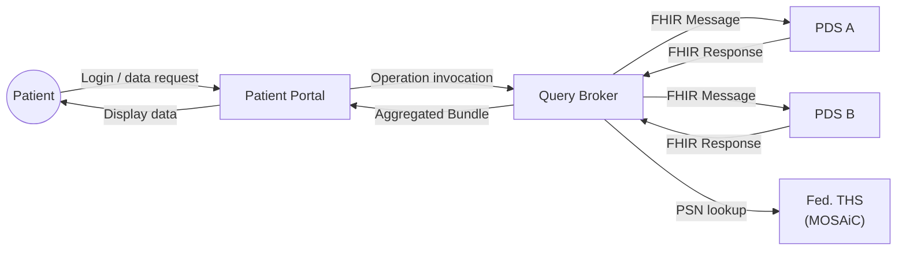
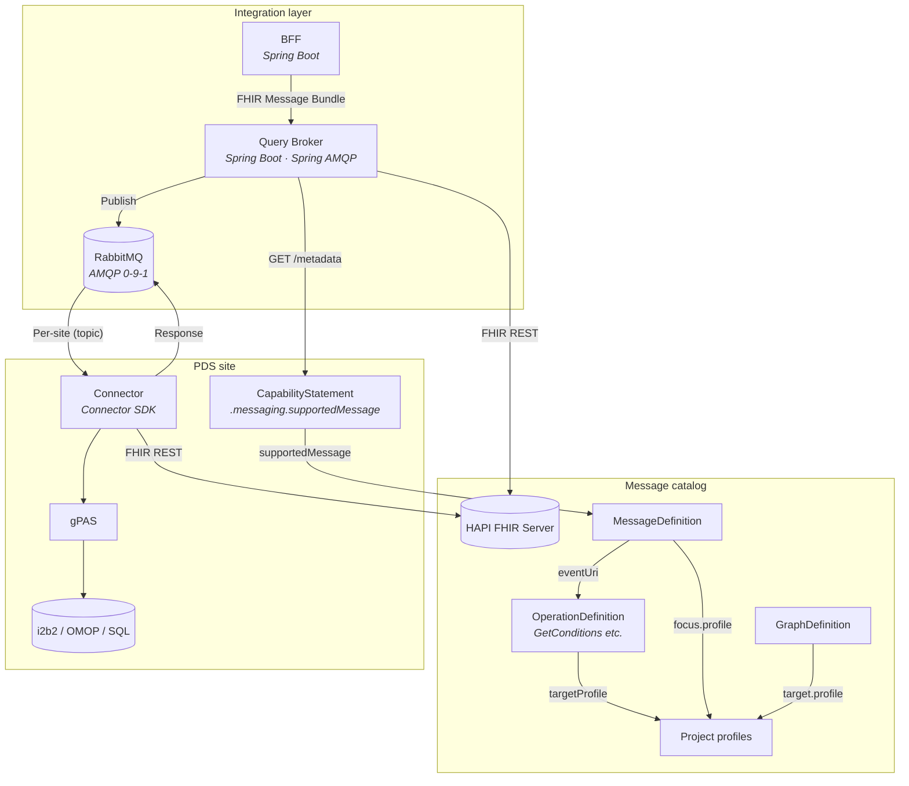

# 3. Context and Scope

[Back to the architecture docs index](README.md)

> **In brief (for newcomers):** The system boundary — the portal, the primary data sources, and the trusted third party it talks to, and in which formats. Terms are defined in the [glossary](12_glossary.md).

## 3.1 Business Context

| External partner | Interface | Format |
|------------------|---------------|--------|
| Patient portal | REST (BFF API) | JSON (FHIR-based) |
| PDS connectors | AMQP (RabbitMQ) | FHIR Message Bundle (`application/fhir+json`) |
| Federated THS | REST (E-PIX API) | E-PIX-specific |
| Message catalog | FHIR REST API | FHIR R4 (OperationDefinition, MessageDefinition, GraphDefinition) |

## 3.2 Technical Context

