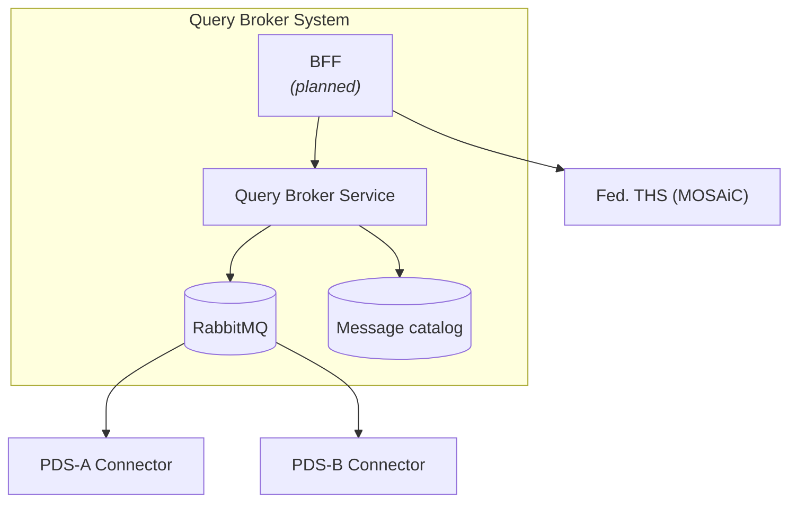
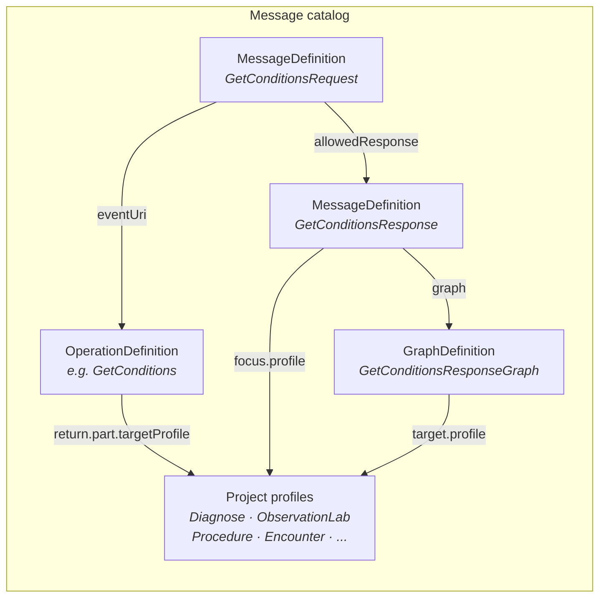
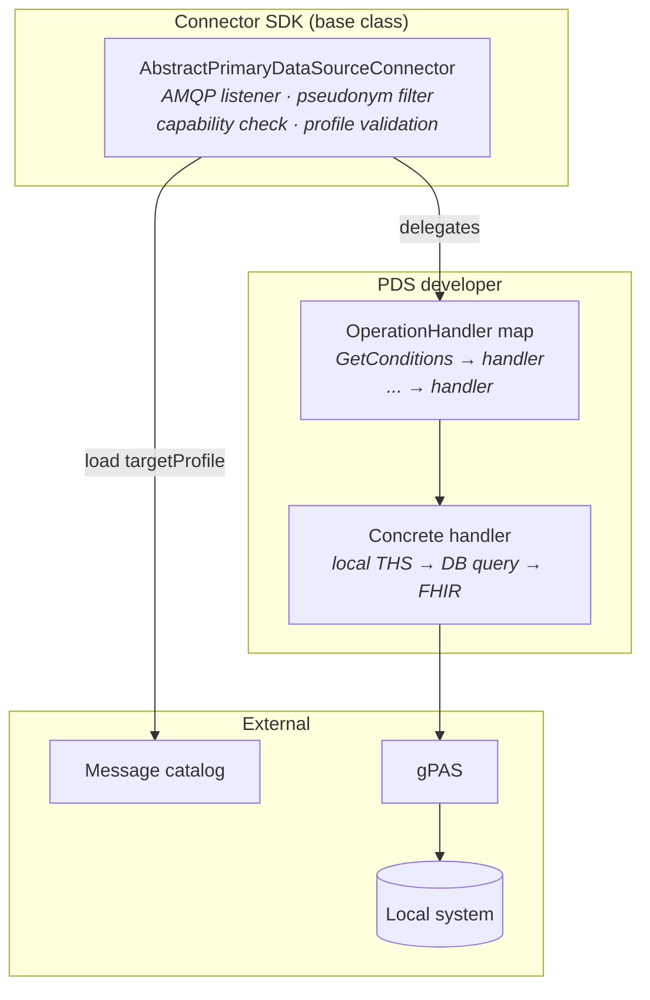

# 5. Building Block View

[Back to the architecture docs index](README.md)

> **In brief (for newcomers):** How the system decomposes into parts — broker, message catalog, connectors, RabbitMQ — each with a diagram and a role table. Terms are defined in the [glossary](12_glossary.md).

## 5.1 Level 1 — Overall System Decomposition

| Building block | Responsibility | Interfaces | Technology |
|----------|-------------------|----------------|-------------|
| **BFF** *(planned — ADR-011; not in this codebase)* | Session, PSN lookup, response shaping | REST ← portal, REST → broker, REST → THS | Spring Boot, HAPI FHIR |
| **Query Broker Service** | Validation (MessageDefinition), routing (by pseudonym gPAS-domain → PDS id), fan-out, aggregation. *(Planned per ADR-004/ADR-008, not yet implemented at runtime: CapabilityStatement-based routing, broker-side profile validation, and `AuditEvent`/`Provenance` emission — the BrokerAuditEvent/BrokerProvenance profiles exist in the catalog but are never instantiated.)* | AMQP → RabbitMQ, FHIR REST → catalog | Spring Boot, Spring AMQP, HAPI FHIR |
| **RabbitMQ** | Message transport (fanout/topic), queue isolation, DLQ | AMQP 0-9-1 | RabbitMQ 3.12+, AsyncAPI 3.0 |
| **Message catalog** | OperationDefinition, MessageDefinition, GraphDefinition, project-specific profiles | FHIR REST API | HAPI FHIR Server, FHIR profile packages |
| **PDS Connector** | Self-filtering, capability check, dispatch, adapter, profile validation before dispatch. *(Planned per ADR-008, not yet implemented in the SDK: `Provenance`/`AuditEvent` emission.)* | AMQP ← RabbitMQ, REST → local THS | Connector SDK (hand-written; contract-checked against the AsyncAPI spec), Spring Boot, HAPI FHIR |
| **Fed. THS** *(planned — not yet built)* | Cross-PDS pseudonym resolution (target architecture) | *Planned:* federated E-PIX. Current THS path is per-site: gPAS `$dePseudonymize` (dispatcher) or a static map. | MOSAiC E-PIX, gPAS |

## 5.2 Level 2 — Message Catalog (Whitebox)

| Building block | Responsibility | FHIR reference |
|----------|-------------------|---------------|
| **OperationDefinition** | Semantics: parameters, types, cardinalities, `targetProfile` → project profile (optional) | [HL7 FHIR R4](https://hl7.org/fhir/R4/operationdefinition.html) |
| **MessageDefinition (Request)** | Message contract: `focus` (mandatory payloads), `allowedResponse` | [HL7 FHIR R4](https://hl7.org/fhir/R4/messagedefinition.html) |
| **MessageDefinition (Response)** | Response contract: `focus.profile` → project profile (optional) | [HL7 FHIR R4](https://hl7.org/fhir/R4/messagedefinition.html) |
| **GraphDefinition** | Payload structure: resource graph, `target.profile` → project profile (optional) | [HL7 FHIR R4](https://hl7.org/fhir/R4/graphdefinition.html) |
| **Project profiles** | FHIR StructureDefinitions for output resources (e.g. MII KDS, US Core, custom profiles) | [Project-specific] |

## 5.3 Level 2 — PDS Connector (Whitebox)

| Building block | Responsibility | Technology |
|----------|-------------------|-------------|
| **AbstractPrimaryDataSourceConnector** | FHIR message parsing, gPAS domain filtering, capability check, `targetProfile` validation. *(Planned per ADR-008, not yet implemented: `Provenance`/`AuditEvent` creation.)* | Connector SDK (hand-written; contract-checked against the AsyncAPI spec), HAPI FHIR Validator |
| **OperationHandler** | Interface: `Bundle execute(String pseudonym, Parameters params)` | `@FunctionalInterface` |
| **Concrete handler** | Adapter: local system → FHIR (profile-conformant if `targetProfile` is declared). *(Per ADR-008 a handler should set `Resource.meta.source` to the connector URL; the reference connector does not yet do this.)* | Provided by the PDS developer, HAPI FHIR |
