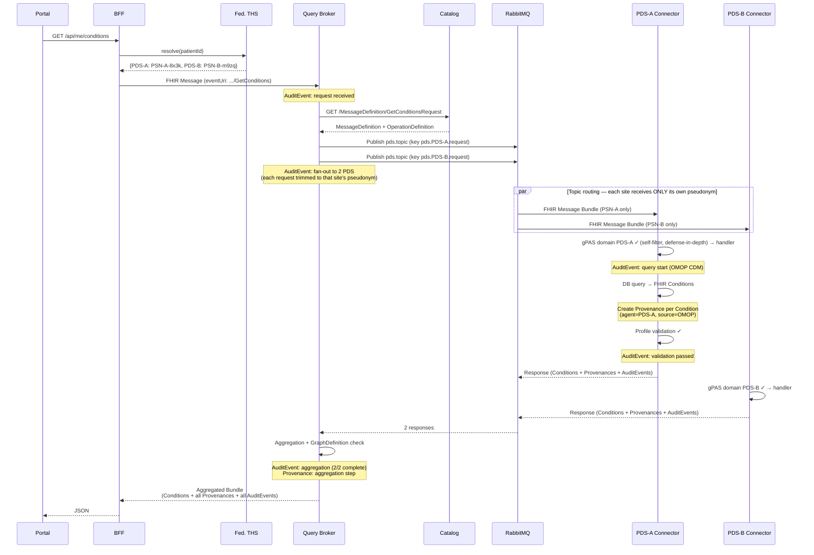

# 6. Runtime View

[Back to the architecture docs index](README.md)

> **In brief (for newcomers):** How those parts collaborate at run time, shown as step-by-step sequence diagrams (e.g. retrieving diagnoses). Terms are defined in the [glossary](12_glossary.md).

## 6.1 Scenario: Retrieve Diagnoses (`$GetConditions`)

## 6.2 Scenario: PDS Does Not Support an Operation

The connector responds with `MessageHeader.response.code = fatal-error` and an `OperationOutcome` resource (`issue.code = not-supported`). The aggregator counts this response as complete but excludes it from the result Bundle.
