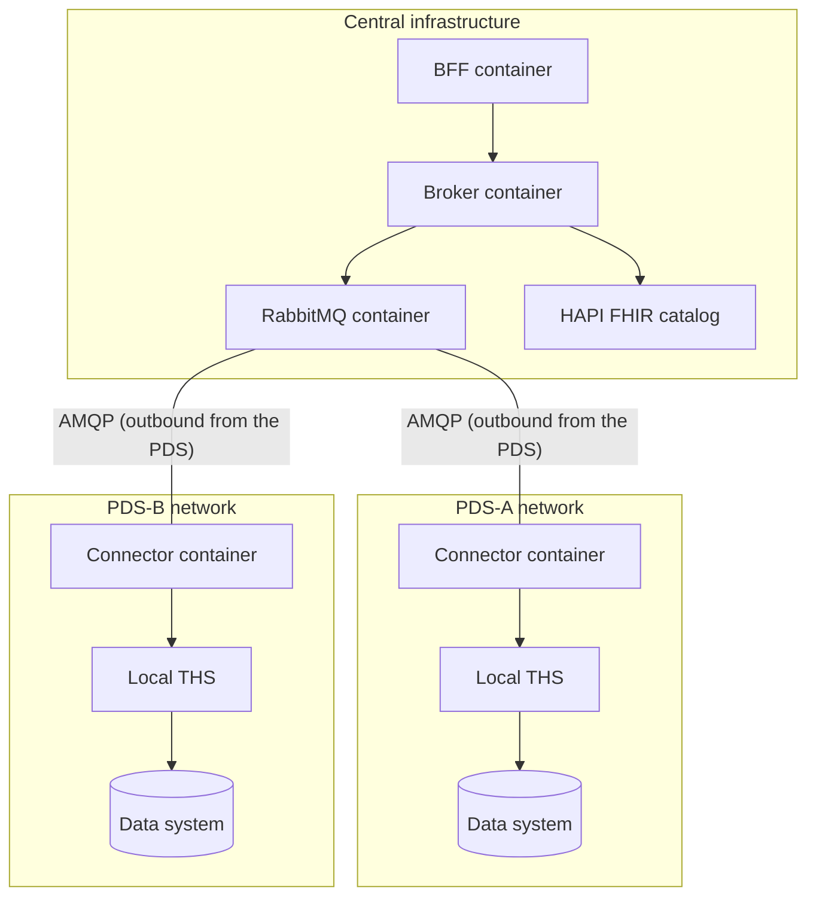

# 7. Deployment View

[Back to the architecture docs index](README.md)

> **In brief (for newcomers):** Where the software runs: central infrastructure vs. the per-site PDS networks, and why connections are outbound-only. Terms are defined in the [glossary](12_glossary.md).

> PDS connectors establish **outbound** AMQP connections to the central RabbitMQ — no inbound connections into PDS networks are needed. This considerably simplifies firewall configuration in hospital networks.
