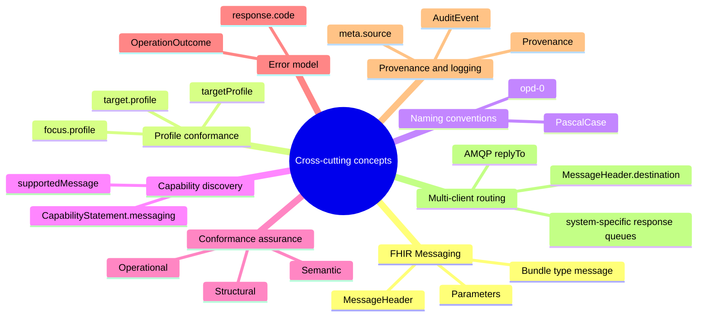
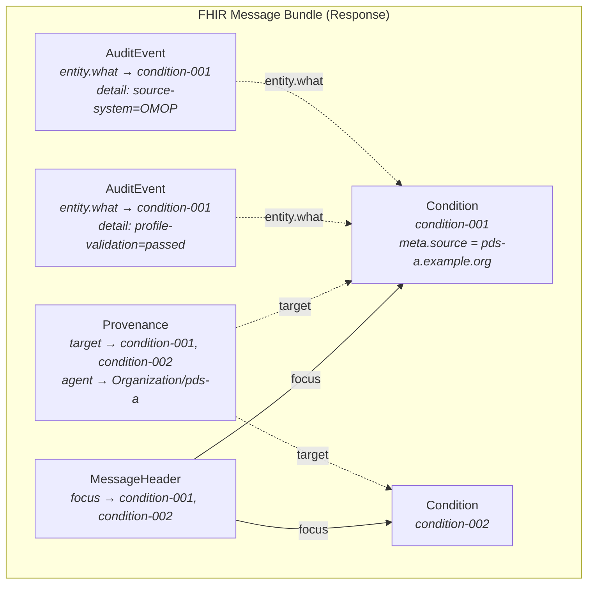

# 8. Cross-cutting Concepts

[Back to the architecture docs index](README.md)

> **In brief (for newcomers):** Concepts that cut across the whole system — FHIR messaging, profile conformance, the error model, provenance/audit, multi-client routing. Terms are defined in the [glossary](12_glossary.md).

> The following concepts span multiple building blocks and layers.

## 8.1 FHIR Messaging as the Message Format

All messages are FHIR R4 Bundles of type `message`. `MessageHeader.eventUri` references the canonical OperationDefinition URL. Parameters and pseudonyms are transmitted as typed entries in a `Parameters` resource. Pseudonyms use the FHIR data type `Identifier` with `system` = gPAS domain (cf. [FHIR R4 Messaging](https://hl7.org/fhir/R4/messaging.html)).

## 8.2 Profile Conformance

Profile binding is optional and project-specific. If a `targetProfile` is declared in the OperationDefinition, it is enforced in three places:

| Location | FHIR element | Effect |
|--------|-------------|---------|
| OperationDefinition | `return.part[].targetProfile` | Declares which profile output resources must conform to |
| MessageDefinition (Response) | `focus[].profile` | Declares the profile for resources in the response message |
| GraphDefinition | `link[].target[].profile` | Declares profiles for linked resources in the response graph |

Validation takes place in the connector (SDK base class) before dispatch (HAPI FHIR Validator + profile packages as a dependency) and optionally in the broker on receipt. Operations without `targetProfile` skip validation — the handler returns base FHIR resources.

> The profiles themselves are configurable per project: MII KDS in the MII context, US Core for US projects, IPS for international scenarios, or custom project profiles. They are installed in the catalog server as FHIR packages (NPM format) and included in the Connector SDK as a dependency.

## 8.3 OperationDefinition Naming Convention

OperationDefinition names follow the FHIR naming scheme (constraint opd-0, regex `[A-Z]([A-Za-z0-9_]){1,254}`). The convention is PascalCase without underscores, analogous to the OperationDefinitions of the FHIR core specification (cf. [FHIR R4 OperationDefinition](https://hl7.org/fhir/R4/operationdefinition.html)).

| Examples (correct) | Examples (incorrect) |
|---------------------|--------------------|
| `GetConditions` | ~~`GET_CONDITIONS`~~ |
| `FetchSomething` | ~~`fetch-something`~~ |
| `RetrieveData` | ~~`retrieveData`~~ (starts with a lowercase letter) |

## 8.4 Capability Discovery

The broker validates each request's operation against a catalog HAPI FHIR server, resolving the `MessageHeader.eventUri` via `GET {catalog}/OperationDefinition?url=…` (lazy, cached — `MessageDefinitionRegistry`). It does not query connectors for CapabilityStatements. Site routing is derived by convention from each pseudonym's gPAS domain system (last path segment → `pdsId`) and, in topic mode, published with routing key `pds.{pdsId}.request`. (CapabilityStatement-based dynamic discovery — `GET /metadata` → `messaging.supportedMessage`, cf. [FHIR R4 CapabilityStatement](https://hl7.org/fhir/R4/capabilitystatement.html) — is a planned future concept, not yet implemented.)

## 8.5 Conformance Assurance

Three dimensions: structural (profile validation), semantic (test data + CodeSystem checks), operational (mock-broker integration tests). Details in [CONTRIBUTING.md](../../CONTRIBUTING.md#3-run-conformance-tests).

## 8.6 Error Model

Errors are transmitted as FHIR `OperationOutcome`. `MessageHeader.response.code` signals `ok`, `transient-error`, or `fatal-error` (cf. [FHIR R4 OperationOutcome](https://hl7.org/fhir/R4/operationoutcome.html)).

## 8.7 Data Provenance and Processing Log

> **Status:** the Provenance/AuditEvent profiles exist in the catalog (BrokerProvenance, BrokerAuditEvent, BrokerProvenanceActivityVS); runtime emission by the connectors and broker (and setting `Resource.meta.source`) is a planned concept (ADR-008) and not yet wired in code.

Two FHIR resources cover proof of origin and logging — without proprietary mechanisms:

**`Provenance`** documents where a business resource comes from (cf. [FHIR R4 Provenance](https://hl7.org/fhir/R4/provenance.html)):

| Element | Usage |
|---------|-----------|
| `target[]` | References to the business resources (Conditions, Observations, etc.) |
| `agent[].who` | `Reference(Organization)` — the PDS as the originating organization |
| `agent[].type` | `performer` (PDS), `assembler` (connector software) |
| `entity[].role` | `source` — the local source system |
| `entity[].what.identifier` | System URL and record ID in the source system (e.g. OMOP `condition_occurrence/48291`) |
| `activity` | Coding from `v3-DataOperation` (`CREATE`, `UPDATE`) |

**`AuditEvent`** documents that a processing step took place (cf. [FHIR R4 AuditEvent](https://hl7.org/fhir/R4/auditevent.html)):

| Element | Usage |
|---------|-----------|
| `action` | `E` (Execute) |
| `period` | Start/end of the processing step |
| `outcome` | `0` (success), `4` (minor failure), `8` (serious failure) |
| `agent[].who` | `Reference(Device)` — connector or broker as the processing instance |
| `entity[].detail[]` | Key-value pairs: `operation`, `pseudonym-domain`, `source-system`, `profile-validation`, `result-count`, `duration-ms` |

**Distribution of responsibilities:**

| Component | Creates | Content |
|------------|---------|--------|
| **PDS Connector** | `Provenance` (per business resource) | PDS organization, source system, connector version, transformation type |
| **PDS Connector** | `AuditEvent` (per processing step) | Query execution (duration, source system), profile validation result |
| **Query Broker** | `AuditEvent` (per broker action) | Request receipt, fan-out (number of PDS), aggregation (complete/partial, timeouts) |
| **Query Broker** | `Provenance` (aggregation step) | Which PDS responses were merged, deduplication |

**Lightweight alternative:** In addition to the full `Provenance`, each connector sets `Resource.meta.source` to the connector URL. This allows a quick look at which resource came from which PDS in the aggregated Bundle — without having to traverse the provenance chain.

**Transport in the Bundle:** Provenance and AuditEvent are transported as regular entries in the FHIR Message Bundle. `MessageHeader.focus` continues to reference only the business resources. Provenance and AuditEvent are linked to the business resources via `Provenance.target` and `AuditEvent.entity.what`:

---

## 8.8 Multi-Client Routing

Multiple requesting systems (portal, CDSS, research portal) can submit requests through the broker concurrently. Routing the aggregated response to the correct system is done via `MessageHeader.destination` (FHIR level) and AMQP `replyTo` (transport level):

| Level | Mechanism | Responsibility |
|-------|-------------|---------------|
| FHIR | `MessageHeader.destination.endpoint` in the request → response queue URI | Requesting system sets it, broker evaluates it |
| AMQP | aggregated response published to the named `responses.{system}` queue via the default exchange (routing key = queue name) | Broker derives the queue from `destination.endpoint`; the request-level `replyTo` is a separate internal request→connector→broker channel (broker sets it to its own `responses.broker`), not client-facing routing |
| Fallback | Requests without `destination` → `responses.default` | Broker uses the default queue |

Each requesting system gets its own response queue (e.g. `responses.portal`, `responses.cdss`). The ResponseAggregator correlates the connector responses via the AMQP `correlationId` (set to the request's `MessageHeader.id`); once complete or timed out, the QueryBrokerService publishes the aggregated Bundle to the queue derived from `MessageHeader.destination.endpoint`.
